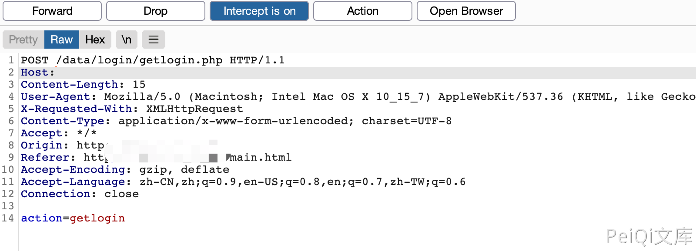

# NetMizer 日志管理系统 main.html 登录绕过漏洞

## 漏洞描述

NetMizer 日志管理系统存在登录绕过漏洞，通过限制某个请求包的发送获取后台权限

## 漏洞影响

<a-checkbox checked>NetMizer 日志管理系统</a-checkbox> 

## 网络测绘

<a-checkbox checked>title="NetMizer 日志管理系统"</a-checkbox> 

## 漏洞复现

登录页面

访问页面 main.html 并抓取请求包, 使用Burp Drop掉下面对请求包

Drop后停止抓包，成功进入后台

