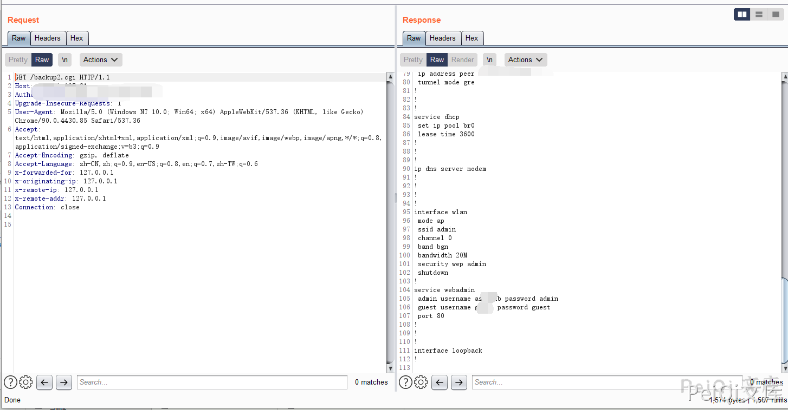

# 宏电 H8922 后台管理员信息泄露漏洞 CVE-2021-28151

## 漏洞描述

宏电 H8922 后台存在管理员信息泄露漏洞，攻击者使用任意账号登录后访问特殊的Url即可获取所有用户的账号和密码

## 漏洞影响

<a-checkbox checked>宏电 H8922</a-checkbox> 

## 网络测绘

<a-checkbox checked>app:"Hongdian H8922 Industrial Router"</a-checkbox> 

## 漏洞复现

登录后台(存在访客用户默认账号密码 guest/guest)

漏洞存在于 backup2.cgi 文件中

分析后可得知实际运行后将会读取 `/tmp/hdconfig/cli.conf` 配置文件

其中配置文件中是含有所有用户密码以及敏感配置信息的