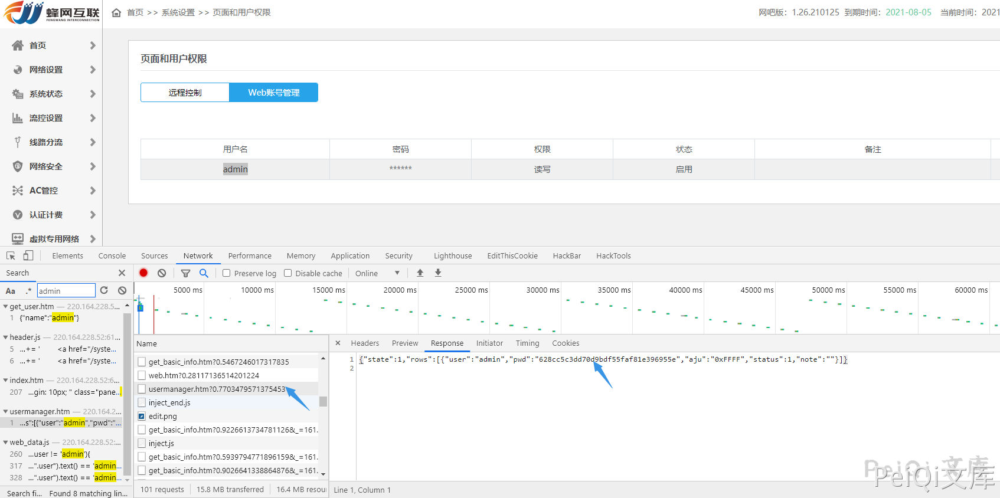
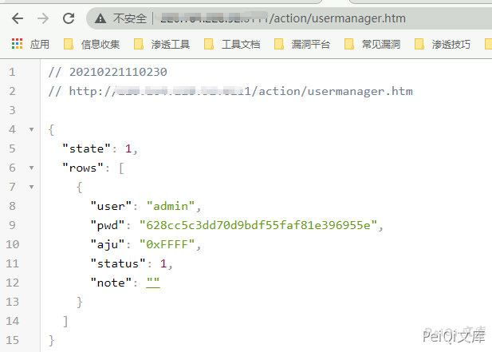

# 蜂网互联 企业级路由器v4.31 密码泄露漏洞 CVE-2019-16313

## 漏洞描述

蜂网互联企业级路由器v4.31存在接口未授权访问，导致攻击者可以是通过此漏洞得到路由器账号密码接管路由器

## 漏洞影响

<a-checkbox checked>蜂网互联企业级路由器v4.31</a-checkbox> 

## 网络测绘

<a-checkbox checked>app="蜂网互联-互联企业级路由器"</a-checkbox> 

## 漏洞复现

登录页面登录后可以看到，账号密码存在接口访问

而 `/action/usermanager.htm` 存在未授权访问，可通过直接访问获得账号密码

- ✅不存在漏洞时  state值为 3