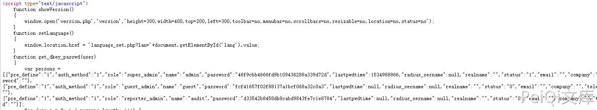

# 锐捷 RG-UAC 账号密码信息泄露 CNVD-2021-14536

## 漏洞描述

锐捷RG-UAC统一上网行为管理审计系统存在账号密码信息泄露,可以间接获取用户账号密码信息登录后台

## 影响版本

<a-checkbox checked>锐捷RG-UAC统一上网行为管理审计系统</a-checkbox> 

## 网络测绘

<a-checkbox checked>title="RG-UAC登录页面"</a-checkbox> 

## 漏洞复现

来到登录页面

按F12查看源码,可以发现账号和密码的md5形式

解密md5得到密码后即可登录系统

## 