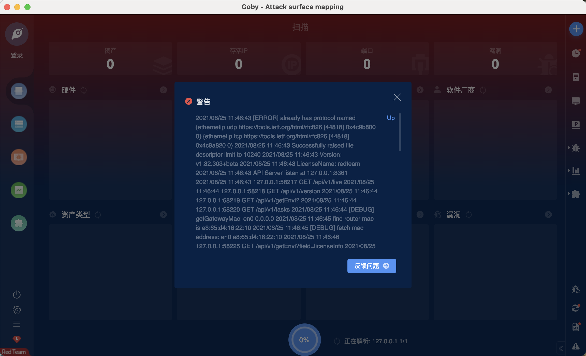

# GO TLS握手 崩溃漏洞 CVE-2021-34558

## 漏洞描述

There is a minor modification to ./vendor/github.com/refraction-networking/utls/handshake_server.go to enable the malicious handshake to be sent with a mismatching certificate/cipher.

## 漏洞影响

<a-checkbox checked>Go Version < (1.16.6+)</a-checkbox> 

## 漏洞复现

<a-alert type="success" message="下载 EXP 并运行: https://github.com/alexzorin/cve-2021-34558" description="" showIcon>
</a-alert>
 

将会生成 https 服务，此时当版本较低时就会产生崩溃，例如部分扫描器对目标进行扫描时

