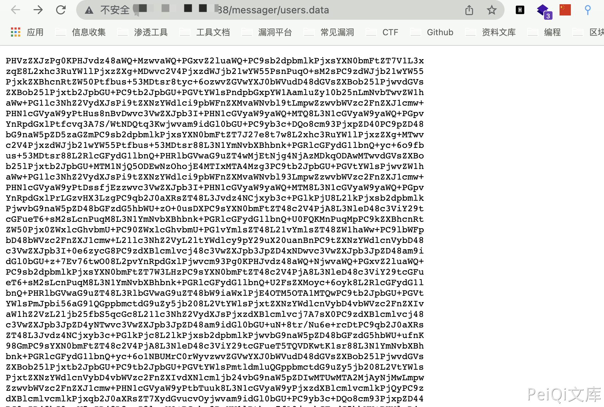

# 泛微OA E-Cology users.data 敏感信息泄漏

## 漏洞描述

泛微OA E-Cology users.data 允许任意用户下载，获取OA中的敏感信息

## 漏洞影响

<a-checkbox checked>泛微OA E-Cology</a-checkbox></br>	

## 网络测绘

<a-checkbox checked>app="泛微-协同商务系统"</a-checkbox></br>

## 漏洞复现

登录页面


验证POC

```php
/messager/users.data
```




base64 GBK解码即可获取OA中的敏感数据