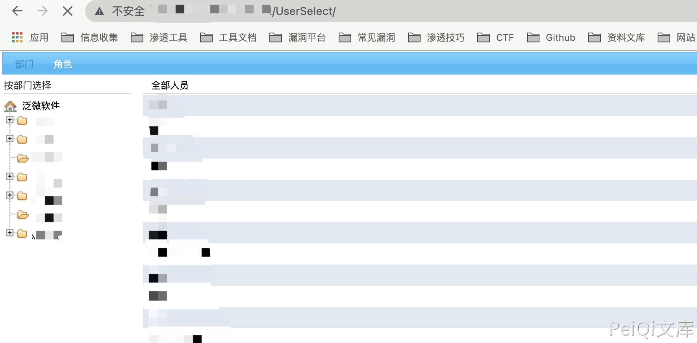

# 泛微OA E-Office UserSelect 未授权访问漏洞

## 漏洞描述

泛微OA E-Office UserSelect接口存在未授权访问漏洞，通过漏洞攻击者可以获取敏感信息

## 漏洞影响

<a-checkbox checked>泛微OA E-Office </a-checkbox></br>

## 网络测绘

<a-checkbox checked>app="泛微-EOffice"</a-checkbox></br>

## 漏洞复现

登录页面


验证POC

```bash
/UserSelect/
```

